# Lesson 5.1: Running Side Effects with `watch()` — Theory & Concepts (Побочные эффекты с watch())
---
## 1. Lesson Metadata
| Field               | Value                                                                 |
| :------------------ | :-------------------------------------------------------------------- |
| **Lesson Number**   | 5.1 of 28 (Part 1 of 2)                                               |
| **Topic**           | Running Side Effects with `watch()` / Побочные эффекты с watch()      |
| **Module**          | Module 1: Core Fundamentals                                           |
| **Prerequisites**   | Lessons 1-4 (Components, ref(), reactive(), computed())               |
| **You Should Know** | Callbacks, async/await, Promises, setTimeout                          |
| **Unlocks**         | Lesson 5.2, then Module 2 (Component Communication)                   |
| **Duration**        | 30-35 minutes                                                         |
**Learning Objectives — Part 1 (Theory):**
1. **Remember:** Define side effects and list the differences between `watch()` and `watchEffect()`
2. **Understand:** Explain when to use watchers vs. computed properties for reactive logic
---
## 2. JS/TS Toolkit (Refresher)
### Callbacks
A callback is a function passed as an argument to another function, to be executed later:
```typescript
// Callback pattern
function doSomething(callback: () => void): void {
  console.log("Doing something...");
  callback(); // Execute the callback
}
doSomething(() => {
  console.log("Done!");
});
// With parameters
function onDataLoaded(callback: (data: string) => void): void {
  setTimeout(() => {
    callback("Loaded data!");
  }, 1000);
}
onDataLoaded((data) => {
  console.log(data); // "Loaded data!" after 1 second
});
```
### Async/Await
Modern syntax for handling asynchronous operations:
```typescript
// Promise-based function
const fetchUser = async (id: number): Promise<User> => {
  const response = await fetch(`/api/users/${id}`);
  const user = await response.json();
  return user;
};
// Using async/await
const loadUser = async (): Promise<void> => {
  try {
    const user = await fetchUser(1);
    console.log(user);
  } catch (error) {
    console.error("Failed to load user:", error);
  }
};
```
---
## 3. Real-World Scenario & Context
**Scenario:** You're building a search feature. As the user types in a search box, you want to:
1. Wait 300ms after they stop typing (debounce)
2. Make an API call to fetch results
3. Update the UI with the results
4. Log the search to analytics
These are **side effects** — operations that happen in response to state changes but don't produce derived values. Unlike `computed()`, you can't just calculate a result; you need to *do* something.
**Framework Context:** Vue's `watch()` lets you react to reactive data changes with custom logic. It's the escape hatch for when you need to perform side effects like API calls, DOM manipulations, logging, or any operation with external effects.
---
## 4. Core Concepts Explained (Deep Dive)
### What is a Side Effect?
A **side effect** is any operation that affects something outside the current function:

```mermaid
graph TD
    subgraph "Pure Function (No Side Effects)"
        A["Input: x, y"] --> B["calculate(x, y)"]
        B --> C["Output: result"]
    end
    
    subgraph "Function with Side Effects"
        D["Input: data"] --> E["saveData(data)"]
        E --> F["Output: void"]
        E --> G["📡 API Call"]
        E --> H["💾 localStorage"]
        E --> I["📊 Analytics"]
        E --> J["🖥️ DOM Update"]
    end
```

Common side effects include:
- API calls (`fetch()`)
- Timers (`setTimeout`, `setInterval`)
- Browser storage (`localStorage`, `sessionStorage`)
- DOM manipulation
- Console logging
- Analytics tracking
### `watch()` vs `computed()` vs `watchEffect()`
Vue provides three reactive primitives, each for a different purpose:
| Feature            | `computed()`                    | `watch()`                           | `watchEffect()`                     |
| :----------------- | :------------------------------ | :---------------------------------- | :---------------------------------- |
| **Purpose**        | Derive new values               | React to specific changes           | React to any change in callback     |
| **Returns**        | A reactive value                | A stop function                     | A stop function                     |
| **Dependencies**   | Auto-tracked from getter        | Explicitly specified                | Auto-tracked from callback          |
| **Runs initially** | When first accessed             | Optionally (`immediate: true`)      | Always (runs immediately)           |
| **Side effects**   | ❌ Should be pure               | ✅ Designed for side effects        | ✅ Designed for side effects        |
| **Async support**  | ❌ No                           | ✅ Yes                              | ✅ Yes                              |

### How `watch()` Works
`watch()` takes two main arguments:
1. **Source**: What to watch (ref, reactive, getter function, or array of sources)
2. **Callback**: What to do when the source changes
```typescript
import { ref, watch } from "vue";
const searchQuery = ref("");
watch(searchQuery, (newValue, oldValue) => {
  console.log(`Search changed from "${oldValue}" to "${newValue}"`);
  // Perform side effect: API call, analytics, etc.
});
```

```mermaid
sequenceDiagram
    participant User
    participant Ref as searchQuery (ref)
    participant Watch as watch()
    participant API as Side Effect
    
    User->>Ref: Types "vue"
    Ref->>Watch: Value changed: "" → "vue"
    Watch->>API: Execute callback
    API-->>Watch: Side effect complete
    
    User->>Ref: Types "vue 3"
    Ref->>Watch: Value changed: "vue" → "vue 3"
    Watch->>API: Execute callback
    API-->>Watch: Side effect complete
```

### `watch()` Source Types
You can watch different types of reactive sources:
```typescript
import { ref, reactive, watch } from "vue";
const count = ref(0);
const user = reactive({ name: "Alice", age: 25 });
// 1. Watch a ref
watch(count, (newVal, oldVal) => {
  console.log(`Count: ${oldVal} → ${newVal}`);
});
// 2. Watch a getter function (for reactive object properties)
watch(
  () => user.name,
  (newName, oldName) => {
    console.log(`Name: ${oldName} → ${newName}`);
  }
);
// 3. Watch entire reactive object (deep by default)
watch(user, (newUser, oldUser) => {
  console.log("User changed:", newUser);
});
// 4. Watch multiple sources
watch([count, () => user.name], ([newCount, newName], [oldCount, oldName]) => {
  console.log(`Count: ${oldCount} → ${newCount}`);
  console.log(`Name: ${oldName} → ${newName}`);
});
```

### Watch Options
`watch()` accepts a third argument for configuration:
```typescript
watch(source, callback, {
  immediate: true,   // Run callback immediately on creation
  deep: true,        // Deeply watch nested properties
  flush: "post",     // Timing: 'pre', 'post', or 'sync'
  once: true,        // Stop after first trigger (Vue 3.4+)
});
```
| Option       | Default   | Description                                                      |
| :----------- | :-------- | :--------------------------------------------------------------- |
| `immediate`  | `false`   | Run callback immediately with current value                      |
| `deep`       | `false`   | Deeply watch nested object mutations                             |
| `flush`      | `'pre'`   | When to run: before (`pre`), after (`post`) DOM update, or `sync`|
| `once`       | `false`   | Automatically stop after first invocation                        |
### `watchEffect()` — Auto-Tracking
`watchEffect()` automatically tracks any reactive dependencies used inside its callback:
```typescript
import { ref, watchEffect } from "vue";
const count = ref(0);
const multiplier = ref(2);
// Automatically tracks count and multiplier
watchEffect(() => {
  console.log(`Result: ${count.value * multiplier.value}`);
});
// Runs immediately with current values
// Re-runs whenever count OR multiplier changes
```

### Mental Model: The Event Listener
Think of `watch()` like an event listener for your data:

- DOM listener: "When this element is clicked, do this"
- Vue watch: "When this data changes, do this"
### Stopping a Watcher
Both `watch()` and `watchEffect()` return a stop function:
```typescript
const stopWatch = watch(count, (newVal) => {
  console.log(newVal);
});
// Later, stop watching
stopWatch();
// Useful for conditional watching
if (someCondition) {
  stopWatch();
}
```
### In Other Contexts
| Framework     | Equivalent Concept                                          |
| :------------ | :---------------------------------------------------------- |
| **React**     | `useEffect()` hook with dependency array                    |
| **Angular**   | RxJS `subscribe()` or `async` pipe                          |
| **Svelte**    | `$:` reactive statements for side effects                   |
| **MobX**      | `reaction()` or `autorun()`                                 |
Vue's `watch()` is similar to React's `useEffect()` with explicit deps, while `watchEffect()` is like MobX's `autorun()` with auto-tracking.
### When to Use / When NOT to Use

---
## 5. New Terminology
| Term                | Definition                                                                                      |
| :------------------ | :---------------------------------------------------------------------------------------------- |
| **Side Effect**     | An operation that affects state outside the current function (API calls, DOM changes, etc.)    |
| **`watch()`**       | Vue function to run a callback when specific reactive sources change                            |
| **`watchEffect()`** | Vue function that auto-tracks dependencies and runs on any tracked change                       |
| **Immediate**       | Option to run watch callback immediately on setup                                               |
| **Deep Watch**      | Option to track all nested property changes in objects                                          |
| **Flush**           | Timing control for when the callback runs relative to DOM updates                               |
---
## 6. Algorithmic Thinking (Planning the Solution)
When implementing reactive side effects, follow this process:
### The Watch Planning Process
1. **Identify the trigger:** What data change should trigger the effect?
   - User types in search box → `searchQuery` ref changes
2. **Define the effect:** What should happen when it changes?
   - Debounce, then fetch from API, then update results
3. **Consider timing:** When should the effect run?
   - After DOM update? Immediately? Debounced?
4. **Handle cleanup:** Need to cancel previous operations?
   - Cancel pending API requests when new search starts

---
## 7. Initial Pattern Introduction
| What You Want (Intent)                | Code Chunk (The Pattern)                         | Conceptual Link        |
| :------------------------------------ | :----------------------------------------------- | :--------------------- |
| React to ref change                   | `watch(ref, (new, old) => {})`                   | Explicit source        |
| React to object property              | `watch(() => obj.prop, (new, old) => {})`        | Getter function        |
| Run immediately on setup              | `watch(source, cb, { immediate: true })`         | Initial execution      |
| Watch nested object changes           | `watch(source, cb, { deep: true })`              | Deep observation       |
| Auto-track dependencies               | `watchEffect(() => { /* use refs */ })`          | Implicit tracking      |
| Async side effect                     | `watch(source, async (new) => { await ... })`    | Async callback         |
| Stop watching                         | `const stop = watch(...); stop()`                | Cleanup                |
### The Basic `watch()` Pattern
```vue
<script setup lang="ts">
import { ref, watch } from "vue";
// ============================================
// STATE
// ============================================
const searchQuery = ref("");
const results = ref<string[]>([]);
const isLoading = ref(false);
const error = ref<string | null>(null);
// ============================================
// WATCH: React to search query changes
// ============================================
watch(searchQuery, async (newQuery, oldQuery) => {
  // Log the change
  console.log(`Search changed: "${oldQuery}" → "${newQuery}"`);
  
  // Skip empty queries
  if (!newQuery.trim()) {
    results.value = [];
    return;
  }
  
  // Side effect: API call
  isLoading.value = true;
  error.value = null;
  
  try {
    const response = await fetch(`/api/search?q=${encodeURIComponent(newQuery)}`);
    const data = await response.json();
    results.value = data.results;
  } catch (e) {
    error.value = "Search failed. Please try again.";
    results.value = [];
  } finally {
    isLoading.value = false;
  }
});
</script>
<template>
  <div>
    <input v-model="searchQuery" placeholder="Search..." />
    <p v-if="isLoading">Loading...</p>
    <p v-if="error" class="error">{{ error }}</p>
    <ul>
      <li v-for="result in results" :key="result">{{ result }}</li>
    </ul>
  </div>
</template>
```
### Watch Options Example
```vue
<script setup lang="ts">
import { reactive, watch } from "vue";
interface UserSettings {
  theme: "light" | "dark";
  notifications: {
    email: boolean;
    push: boolean;
  };
}
const settings = reactive<UserSettings>({
  theme: "light",
  notifications: {
    email: true,
    push: false,
  },
});
// Watch with options
watch(
  settings,
  (newSettings) => {
    // Save to localStorage on any change
    localStorage.setItem("userSettings", JSON.stringify(newSettings));
    console.log("Settings saved:", newSettings);
  },
  {
    deep: true,      // Watch nested changes
    immediate: true, // Save initial value too
  }
);
// Watch specific property with getter
watch(
  () => settings.theme,
  (newTheme) => {
    document.documentElement.setAttribute("data-theme", newTheme);
  },
  { immediate: true }
);
</script>
```
### `watchEffect()` Example
```vue
<script setup lang="ts">
import { ref, watchEffect } from "vue";
const userId = ref(1);
const userData = ref<User | null>(null);
const isLoading = ref(false);
// watchEffect auto-tracks userId
watchEffect(async () => {
  isLoading.value = true;
  
  // This automatically becomes a dependency
  const response = await fetch(`/api/users/${userId.value}`);
  userData.value = await response.json();
  
  isLoading.value = false;
});
// When userId.value changes, the effect re-runs automatically
</script>
```
### Cleanup Pattern (Cancellation)
```vue
<script setup lang="ts">
import { ref, watch } from "vue";
const searchQuery = ref("");
const results = ref<string[]>([]);
watch(searchQuery, async (newQuery, oldQuery, onCleanup) => {
  // Create abort controller for this request
  const controller = new AbortController();
  
  // Register cleanup function
  onCleanup(() => {
    controller.abort(); // Cancel request if query changes again
  });
  
  try {
    const response = await fetch(`/api/search?q=${newQuery}`, {
      signal: controller.signal,
    });
    results.value = await response.json();
  } catch (e) {
    if ((e as Error).name !== "AbortError") {
      console.error("Search failed:", e);
    }
  }
});
</script>
```
### Reactivity Flow Diagram

---
## 8. Comprehension Check
1. **What is the key difference between `computed()` and `watch()` in terms of what they're designed for?**
2. **When would you use `watchEffect()` instead of `watch()`? What's the main advantage?**
3. **True or False:** The `immediate: true` option makes the watch callback run once during component setup with the current value.
---
**Reply 'next' for Lesson 5.2 (Practice).**
