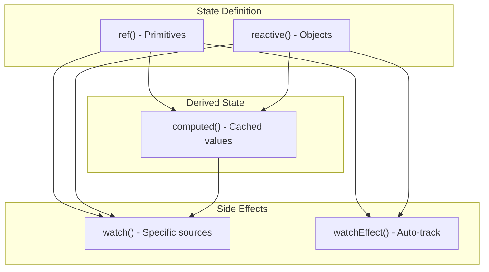

# Lesson 5.2: Running Side Effects with `watch()` — Practice & Application (Побочные эффекты с watch())
---
## 1. Lesson Metadata
| Field              | Value                                                               |
| :----------------- | :------------------------------------------------------------------ |
| **Lesson Number**  | 5.2 of 28 (Part 2 of 2)                                             |
| **Topic**          | Running Side Effects with `watch()` / Побочные эффекты с watch()    |
| **Continues From** | Lesson 5.1                                                          |
| **Duration**       | 30-35 minutes                                                       |
**Learning Objectives — Part 2 (Practice):**
1. **Apply:** Implement watchers with debouncing, API calls, and cleanup
2. **Analyze:** Debug common watcher issues and choose between `watch()` and `watchEffect()`
---
## 2. Quick Recap
- **`watch(source, callback)`** runs when specific reactive sources change
- **`watchEffect(callback)`** auto-tracks all dependencies used in the callback
- **Options:** `immediate` (run on setup), `deep` (nested changes), `flush` (timing)
- **Cleanup:** Use `onCleanup` callback to cancel pending operations
- **Async:** Watch callbacks can be async for API calls
---
## 3. The Variable Frame & Complexity Scale
### Basic Form: Simple Logging
```vue
<script setup lang="ts">
import { ref, watch } from "vue";
const count = ref(0);
watch(count, (newVal, oldVal) => {
  console.log(`Count: ${oldVal} → ${newVal}`);
});
</script>
```
### With Options: Immediate and Deep
```vue
<script setup lang="ts">
import { reactive, watch } from "vue";
interface Settings {
  theme: string;
  fontSize: number;
  notifications: { email: boolean; push: boolean };
}
const settings = reactive<Settings>({
  theme: "dark",
  fontSize: 16,
  notifications: { email: true, push: false },
});
watch(
  settings,
  (newSettings) => {
    localStorage.setItem("settings", JSON.stringify(newSettings));
  },
  { deep: true, immediate: true }
);
</script>
```
### Advanced Form: Debounced API Call with Cleanup
```vue
<script setup lang="ts">
import { ref, watch } from "vue";
const searchQuery = ref("");
const results = ref<string[]>([]);
const isLoading = ref(false);
watch(searchQuery, async (query, oldQuery, onCleanup) => {
  if (!query.trim()) {
    results.value = [];
    return;
  }
  const controller = new AbortController();
  onCleanup(() => controller.abort());
  // Debounce: wait before fetching
  await new Promise((resolve) => setTimeout(resolve, 300));
  
  if (controller.signal.aborted) return;
  isLoading.value = true;
  try {
    const res = await fetch(`/api/search?q=${query}`, { signal: controller.signal });
    results.value = await res.json();
  } catch (e) {
    if ((e as Error).name !== "AbortError") console.error(e);
  } finally {
    isLoading.value = false;
  }
});
</script>
```
---
## 4. Micro-Implementation Drills
### Drill 1 (Basic): Console Logger
Create a watcher that logs value changes to the console.
```vue
<script setup lang="ts">
import { ref, watch } from "vue";
const message = ref("Hello");
// TODO: Create a watcher that logs:
// "Message changed from '[old]' to '[new]'"
</script>
<template>
  <input v-model="message" />
</template>
```
**Solution:**
```vue
<script setup lang="ts">
import { ref, watch } from "vue";
const message = ref("Hello");
watch(message, (newValue, oldValue) => {
  console.log(`Message changed from '${oldValue}' to '${newValue}'`);
});
</script>
<template>
  <div>
    <input v-model="message" class="input input-bordered" />
    <p>Current: {{ message }}</p>
  </div>
</template>
```
---
### Drill 2 (Variation): LocalStorage Persistence
Save form data to localStorage whenever it changes.
```vue
<script setup lang="ts">
import { reactive, watch, onMounted } from "vue";
interface FormData {
  name: string;
  email: string;
  subscribe: boolean;
}
const form = reactive<FormData>({
  name: "",
  email: "",
  subscribe: false,
});
// TODO: Load from localStorage on mount
// TODO: Watch form and save to localStorage on every change (deep)
</script>
<template>
  <form>
    <input v-model="form.name" placeholder="Name" />
    <input v-model="form.email" placeholder="Email" />
    <label>
      <input type="checkbox" v-model="form.subscribe" />
      Subscribe
    </label>
  </form>
</template>
```
**Solution:**
```vue
<script setup lang="ts">
import { reactive, watch, onMounted } from "vue";
interface FormData {
  name: string;
  email: string;
  subscribe: boolean;
}
const STORAGE_KEY = "form-data";
const form = reactive<FormData>({
  name: "",
  email: "",
  subscribe: false,
});
onMounted(() => {
  const saved = localStorage.getItem(STORAGE_KEY);
  if (saved) {
    try {
      const parsed = JSON.parse(saved) as FormData;
      Object.assign(form, parsed);
    } catch (e) {
      console.error("Failed to parse saved form data");
    }
  }
});
watch(
  form,
  (newForm) => {
    localStorage.setItem(STORAGE_KEY, JSON.stringify(newForm));
    console.log("Form saved to localStorage");
  },
  { deep: true }
);
</script>
<template>
  <form class="space-y-4 max-w-sm">
    <input v-model="form.name" placeholder="Name" class="input input-bordered w-full" />
    <input v-model="form.email" placeholder="Email" class="input input-bordered w-full" />
    <label class="flex items-center gap-2">
      <input type="checkbox" v-model="form.subscribe" class="checkbox" />
      Subscribe to newsletter
    </label>
    <p class="text-sm text-base-content/60">Form auto-saves to localStorage</p>
  </form>
</template>
```
---
### Drill 3 (Combination): Debounced Search
Implement a search with debouncing to avoid excessive API calls.
```vue
<script setup lang="ts">
import { ref, watch } from "vue";
const searchQuery = ref("");
const results = ref<{ id: number; title: string }[]>([]);
const isSearching = ref(false);
// TODO: Watch searchQuery with 500ms debounce
// TODO: Simulate API call with setTimeout
// TODO: Show loading state during search
</script>
<template>
  <div>
    <input v-model="searchQuery" placeholder="Search..." />
    <p v-if="isSearching">Searching...</p>
    <ul>
      <li v-for="result in results" :key="result.id">{{ result.title }}</li>
    </ul>
  </div>
</template>
```
**Solution:**
```vue
<script setup lang="ts">
import { ref, watch } from "vue";
interface SearchResult {
  id: number;
  title: string;
}
const searchQuery = ref("");
const results = ref<SearchResult[]>([]);
const isSearching = ref(false);
const searchCount = ref(0);
// Simulated API data
const mockData: SearchResult[] = [
  { id: 1, title: "Vue.js Guide" },
  { id: 2, title: "TypeScript Handbook" },
  { id: 3, title: "Vite Documentation" },
  { id: 4, title: "Pinia State Management" },
  { id: 5, title: "Vue Router Guide" },
];
watch(searchQuery, async (query, oldQuery, onCleanup) => {
  // Clear results for empty query
  if (!query.trim()) {
    results.value = [];
    return;
  }
  // Abort controller for cleanup
  let aborted = false;
  onCleanup(() => {
    aborted = true;
  });
  // Debounce: wait 500ms
  await new Promise((resolve) => setTimeout(resolve, 500));
  // Check if superseded by new search
  if (aborted) return;
  isSearching.value = true;
  searchCount.value++;
  // Simulate API delay
  await new Promise((resolve) => setTimeout(resolve, 800));
  if (aborted) return;
  // Filter mock data (simulating API response)
  const filtered = mockData.filter((item) =>
    item.title.toLowerCase().includes(query.toLowerCase())
  );
  results.value = filtered;
  isSearching.value = false;
});
</script>
<template>
  <div class="max-w-md mx-auto space-y-4">
    <input
      v-model="searchQuery"
      placeholder="Search documentation..."
      class="input input-bordered w-full"
    />
    <p class="text-sm text-base-content/60">
      Searches: {{ searchCount }} | Debounce: 500ms
    </p>
    <div v-if="isSearching" class="flex items-center gap-2">
      <span class="loading loading-spinner loading-sm"></span>
      Searching...
    </div>
    <ul v-else-if="results.length > 0" class="space-y-2">
      <li
        v-for="result in results"
        :key="result.id"
        class="p-2 bg-base-200 rounded"
      >
        {{ result.title }}
      </li>
    </ul>
    <p v-else-if="searchQuery && !isSearching" class="text-base-content/60">
      No results found
    </p>
  </div>
</template>
```
---
### Drill 4 (Edge Case): Watch Multiple Sources
Watch multiple refs and react to any change.
```vue
<script setup lang="ts">
import { ref, watch } from "vue";
const firstName = ref("John");
const lastName = ref("Doe");
const age = ref(25);
// TODO: Watch all three values
// TODO: Generate a full description when any changes
// TODO: Use array syntax for multiple sources
</script>
<template>
  <div>
    <input v-model="firstName" placeholder="First Name" />
    <input v-model="lastName" placeholder="Last Name" />
    <input v-model.number="age" type="number" placeholder="Age" />
    <p>Description will appear here...</p>
  </div>
</template>
```
**Solution:**
```vue
<script setup lang="ts">
import { ref, watch } from "vue";
const firstName = ref("John");
const lastName = ref("Doe");
const age = ref(25);
const description = ref("");
const changeLog = ref<string[]>([]);
// Watch multiple sources with array syntax
watch(
  [firstName, lastName, age],
  ([newFirst, newLast, newAge], [oldFirst, oldLast, oldAge]) => {
    // Generate description
    description.value = `${newFirst} ${newLast}, ${newAge} years old`;
    // Log what changed
    const changes: string[] = [];
    if (newFirst !== oldFirst) changes.push(`First name: ${oldFirst} → ${newFirst}`);
    if (newLast !== oldLast) changes.push(`Last name: ${oldLast} → ${newLast}`);
    if (newAge !== oldAge) changes.push(`Age: ${oldAge} → ${newAge}`);
    if (changes.length > 0) {
      changeLog.value.unshift(...changes);
      // Keep only last 5 entries
      if (changeLog.value.length > 5) {
        changeLog.value = changeLog.value.slice(0, 5);
      }
    }
  },
  { immediate: true }
);
</script>
<template>
  <div class="max-w-md mx-auto space-y-4">
    <div class="grid grid-cols-3 gap-2">
      <input v-model="firstName" placeholder="First Name" class="input input-bordered" />
      <input v-model="lastName" placeholder="Last Name" class="input input-bordered" />
      <input v-model.number="age" type="number" placeholder="Age" class="input input-bordered" />
    </div>
    <div class="p-4 bg-base-200 rounded">
      <p class="font-bold">{{ description }}</p>
    </div>
    <div v-if="changeLog.length > 0">
      <p class="text-sm font-semibold">Change Log:</p>
      <ul class="text-sm text-base-content/60">
        <li v-for="(log, i) in changeLog" :key="i">{{ log }}</li>
      </ul>
    </div>
  </div>
</template>
```
---
## 5. Common Pitfalls & Anti-Patterns
| ❌ Common Mistake                        | ✅ Correct Approach                        | Why It Matters                                         |
| :--------------------------------------- | :----------------------------------------- | :----------------------------------------------------- |
| Using watch for derived values           | Use `computed()` for derived values        | Computed is cached and more efficient                  |
| Forgetting to handle async cleanup       | Use `onCleanup` to abort/cancel            | Prevents race conditions and stale updates             |
| Watching reactive object without `deep`  | Add `{ deep: true }` for nested changes    | By default, only reference changes trigger watch       |
### Example of Each Mistake
**Mistake 1: Using Watch for Derived Values**
```vue
<script setup lang="ts">
import { ref, watch, computed } from "vue";
const price = ref(100);
const quantity = ref(2);
const total = ref(0);
// ❌ WRONG: Using watch to calculate derived value
watch([price, quantity], ([p, q]) => {
  total.value = p * q;
}, { immediate: true });
// ✅ CORRECT: Use computed for derived values
const totalComputed = computed(() => price.value * quantity.value);
</script>
```
**Mistake 2: Not Handling Async Cleanup**
```vue
<script setup lang="ts">
import { ref, watch } from "vue";
const userId = ref(1);
const userData = ref(null);
// ❌ WRONG: No cleanup - causes race condition
watch(userId, async (id) => {
  const res = await fetch(`/api/users/${id}`);
  userData.value = await res.json();
  // If userId changes during fetch, stale data overwrites!
});
// ✅ CORRECT: Use cleanup to abort
watch(userId, async (id, oldId, onCleanup) => {
  const controller = new AbortController();
  onCleanup(() => controller.abort());
  try {
    const res = await fetch(`/api/users/${id}`, { signal: controller.signal });
    userData.value = await res.json();
  } catch (e) {
    if ((e as Error).name !== "AbortError") {
      console.error(e);
    }
  }
});
</script>
```
**Mistake 3: Missing `deep` Option**
```vue
<script setup lang="ts">
import { reactive, watch } from "vue";
const user = reactive({
  name: "Alice",
  settings: { theme: "dark" },
});
// ❌ WRONG: Won't trigger when settings.theme changes
watch(user, (newUser) => {
  console.log("User changed:", newUser);
});
// ✅ CORRECT: Add deep option for nested changes
watch(
  user,
  (newUser) => {
    console.log("User changed:", newUser);
  },
  { deep: true }
);
// ✅ ALTERNATIVE: Watch specific nested property
watch(
  () => user.settings.theme,
  (newTheme) => {
    console.log("Theme changed:", newTheme);
  }
);
</script>
```
---
## 6. Mini-Project: Number Doubler with Validation
Build a component that watches for number input changes, validates, and logs to console.
### File Structure
```
src/
├── components/
│   └── NumberDoubler.vue
├── App.vue
└── main.ts
```
### NumberDoubler.vue
```vue
<script setup lang="ts">
// ============================================
// IMPORTS
// ============================================
import { ref, watch, watchEffect, computed } from "vue";
// ============================================
// STATE
// ============================================
const inputValue = ref<number | null>(null);
const doubledValue = ref<number | null>(null);
const validationError = ref<string | null>(null);
const changeHistory = ref<{ input: number; output: number; timestamp: Date }[]>([]);
const isProcessing = ref(false);
// ============================================
// VALIDATION RULES
// ============================================
const MIN_VALUE = 0;
const MAX_VALUE = 1000;
// ============================================
// COMPUTED: Validation Status
// ============================================
const isValid = computed((): boolean => {
  if (inputValue.value === null) return true;
  return (
    inputValue.value >= MIN_VALUE &&
    inputValue.value <= MAX_VALUE &&
    Number.isFinite(inputValue.value)
  );
});
// ============================================
// WATCH: Input Value Changes
// ============================================
watch(inputValue, async (newValue, oldValue) => {
  // Log to console (as specified in requirements)
  console.log(`Input changed: ${oldValue} → ${newValue}`);
  // Clear previous error
  validationError.value = null;
  // Handle null/empty
  if (newValue === null || newValue === undefined) {
    doubledValue.value = null;
    return;
  }
  // Validate range
  if (newValue < MIN_VALUE) {
    validationError.value = `Value must be at least ${MIN_VALUE}`;
    doubledValue.value = null;
    return;
  }
  if (newValue > MAX_VALUE) {
    validationError.value = `Value must be at most ${MAX_VALUE}`;
    doubledValue.value = null;
    return;
  }
  // Validate type
  if (!Number.isFinite(newValue)) {
    validationError.value = "Please enter a valid number";
    doubledValue.value = null;
    return;
  }
  // Simulate async processing (like an API call)
  isProcessing.value = true;
  await new Promise((resolve) => setTimeout(resolve, 300));
  // Calculate doubled value
  const doubled = newValue * 2;
  doubledValue.value = doubled;
  isProcessing.value = false;
  // Log to console
  console.log(`Doubled: ${newValue} × 2 = ${doubled}`);
  // Add to history
  changeHistory.value.unshift({
    input: newValue,
    output: doubled,
    timestamp: new Date(),
  });
  // Keep only last 10 entries
  if (changeHistory.value.length > 10) {
    changeHistory.value = changeHistory.value.slice(0, 10);
  }
});
// ============================================
// WATCHEFFECT: Document Title
// ============================================
watchEffect(() => {
  if (doubledValue.value !== null) {
    document.title = `Doubled: ${doubledValue.value}`;
  } else {
    document.title = "Number Doubler";
  }
});
// ============================================
// ACTIONS
// ============================================
const clearInput = (): void => {
  inputValue.value = null;
  doubledValue.value = null;
  validationError.value = null;
};
const clearHistory = (): void => {
  changeHistory.value = [];
};
const setQuickValue = (value: number): void => {
  inputValue.value = value;
};
// ============================================
// HELPERS
// ============================================
const formatTime = (date: Date): string => {
  return date.toLocaleTimeString();
};
</script>
<template>
  <div class="card bg-base-100 shadow-xl max-w-lg mx-auto">
    <div class="card-body">
      <h2 class="card-title justify-center text-2xl mb-4">
        🔢 Number Doubler
      </h2>
      <!-- Input Section -->
      <div class="form-control">
        <label class="label">
          <span class="label-text">Enter a number ({{ MIN_VALUE }}-{{ MAX_VALUE }})</span>
        </label>
        <input
          v-model.number="inputValue"
          type="number"
          :min="MIN_VALUE"
          :max="MAX_VALUE"
          placeholder="Enter a number..."
          class="input input-bordered"
          :class="{ 'input-error': validationError }"
        />
        <label v-if="validationError" class="label">
          <span class="label-text-alt text-error">{{ validationError }}</span>
        </label>
      </div>
      <!-- Quick Values -->
      <div class="flex flex-wrap gap-2 mt-2">
        <button
          v-for="val in [1, 5, 10, 50, 100]"
          :key="val"
          @click="setQuickValue(val)"
          class="btn btn-sm btn-outline"
        >
          {{ val }}
        </button>
      </div>
      <!-- Result Display -->
      <div class="my-6 text-center">
        <div v-if="isProcessing" class="flex justify-center items-center gap-2">
          <span class="loading loading-spinner"></span>
          Calculating...
        </div>
        <div v-else-if="doubledValue !== null" class="space-y-2">
          <p class="text-base-content/60">
            {{ inputValue }} × 2 =
          </p>
          <p class="text-5xl font-bold text-primary">
            {{ doubledValue }}
          </p>
        </div>
        <div v-else-if="!validationError" class="text-base-content/60">
          Enter a number to see it doubled
        </div>
      </div>
      <!-- Actions -->
      <div class="flex justify-center gap-2">
        <button @click="clearInput" class="btn btn-ghost">
          Clear Input
        </button>
      </div>
      <!-- History -->
      <div v-if="changeHistory.length > 0" class="mt-6">
        <div class="flex justify-between items-center mb-2">
          <h3 class="font-semibold">History</h3>
          <button @click="clearHistory" class="btn btn-xs btn-ghost">
            Clear
          </button>
        </div>
        <div class="overflow-x-auto">
          <table class="table table-sm">
            <thead>
              <tr>
                <th>Input</th>
                <th>Output</th>
                <th>Time</th>
              </tr>
            </thead>
            <tbody>
              <tr v-for="(entry, i) in changeHistory" :key="i">
                <td>{{ entry.input }}</td>
                <td class="font-bold">{{ entry.output }}</td>
                <td class="text-base-content/60">{{ formatTime(entry.timestamp) }}</td>
              </tr>
            </tbody>
          </table>
        </div>
      </div>
      <!-- Console Notice -->
      <div class="alert mt-4">
        <span>💡 Check browser console to see watch logs!</span>
      </div>
    </div>
  </div>
</template>
```
### App.vue
```vue
<script setup lang="ts">
import NumberDoubler from "./components/NumberDoubler.vue";
</script>
<template>
  <div class="min-h-screen bg-base-200 py-10 px-4">
    <NumberDoubler />
  </div>
</template>
```
### How to Test
1. Run `npm run dev`
2. Open the browser and developer console
3. Verify:
   - Typing a number logs "Input changed: X → Y" to console
   - Valid numbers show doubled result after brief processing
   - Invalid numbers (< 0, > 1000, non-numbers) show error
   - Console shows "Doubled: X × 2 = Y" for valid inputs
   - History table tracks recent calculations
   - Document title updates with current result
   - Quick value buttons work correctly
---
## 7. Implementation Exercises (Progressive)
### Level 1 (Recall): Fill in the Blanks
```vue
<script setup lang="ts">
import { ref, _____ } from "vue";
const count = ref(0);
_____(count, (newVal, _____) => {
  console.log(`Changed from ${oldVal} to ${_____}`);
});
// Watch with immediate
watch(
  count,
  (val) => {
    console.log("Current:", val);
  },
  { _____: true }
);
</script>
<template>
  <button @click="count++">Count: {{ count }}</button>
</template>
```
**Answer:**
```vue
<script setup lang="ts">
import { ref, watch } from "vue";
const count = ref(0);
watch(count, (newVal, oldVal) => {
  console.log(`Changed from ${oldVal} to ${newVal}`);
});
watch(
  count,
  (val) => {
    console.log("Current:", val);
  },
  { immediate: true }
);
</script>
<template>
  <button @click="count++">Count: {{ count }}</button>
</template>
```
---
### Level 2 (Apply): Independent Coding Tasks
**Exercise 2.1: Theme Persistence**
Create a component with:
- A theme toggle (light/dark)
- Watch that saves theme to localStorage
- Load theme from localStorage on mount
- Apply theme to document element
**Exercise 2.2: Auto-Save Form**
Create a component with:
- A textarea for notes
- Auto-save to localStorage every 2 seconds after typing stops (debounced)
- Show "Saving..." indicator while debounce is pending
- Show "Saved!" message after save completes
---
### Level 3 (Debug): Find and Fix the Bugs
This component has **4 bugs**. Find and fix them:
```vue
<script setup lang="ts">
import { reactive, watch } from "vue";
const user = reactive({
  name: "Alice",
  preferences: {
    theme: "dark",
    language: "en",
  },
});
// Bug 1: Won't detect nested changes
watch(user, (newUser) => {
  localStorage.setItem("user", JSON.stringify(newUser));
});
// Bug 2: Race condition with async
watch(
  () => user.name,
  async (name) => {
    const response = await fetch(`/api/validate?name=${name}`);
    const result = await response.json();
    console.log(result);
  }
);
// Bug 3: Using computed pattern with watch
const fullName = watch(
  () => user.name,
  (name) => {
    return `User: ${name}`;
  }
);
</script>
<template>
  <div>
    <input v-model="user.name" />
    <p>{{ fullName }}</p>
  </div>
</template>
```
**Corrected Code:**
```vue
<script setup lang="ts">
import { reactive, watch, computed } from "vue";
const user = reactive({
  name: "Alice",
  preferences: {
    theme: "dark",
    language: "en",
  },
});
// Fix 1: Add deep: true for nested changes
watch(
  user,
  (newUser) => {
    localStorage.setItem("user", JSON.stringify(newUser));
  },
  { deep: true }
);
// Fix 2: Add cleanup to handle race conditions
watch(
  () => user.name,
  async (name, oldName, onCleanup) => {
    const controller = new AbortController();
    onCleanup(() => controller.abort());
    try {
      const response = await fetch(`/api/validate?name=${name}`, {
        signal: controller.signal,
      });
      const result = await response.json();
      console.log(result);
    } catch (e) {
      if ((e as Error).name !== "AbortError") {
        console.error(e);
      }
    }
  }
);
// Fix 3: Use computed for derived values, not watch
const fullName = computed(() => `User: ${user.name}`);
</script>
<template>
  <div>
    <input v-model="user.name" />
    <p>{{ fullName }}</p>
  </div>
</template>
```
---
## 8. Module 1 Checkpoint
🎉 **Congratulations!** You've completed Module 1: Core Fundamentals!
### What You've Learned
| Lesson | Topic                        | Key Concept                              |
| :----: | :--------------------------- | :--------------------------------------- |
|   1    | Your First Component         | SFCs, `<script setup>`, template syntax  |
|   2    | `ref()`                      | Reactive primitives, `.value` access     |
|   3    | `reactive()`                 | Reactive objects, deep reactivity        |
|   4    | `computed()`                 | Derived state, caching, pure functions   |
|   5    | `watch()` / `watchEffect()`  | Side effects, async operations, cleanup  |
### Module 1 Pattern Summary

### Ready for Next Module
You're now ready to proceed to **Module 2: Component Communication** where you'll learn:
- Passing data with **Props**
- Emitting events from child to parent
- Building reusable component patterns
---
**Reply 'next' for Lesson 6.1 (Props — Theory).**
