# Lesson 1.1: Your First Component — Theory & Concepts (Ваш первый компонент)
---
## 1. Lesson Metadata
| Field               | Value                                                                 |
| :------------------ | :-------------------------------------------------------------------- |
| **Lesson Number**   | 1.1 of 28 (Part 1 of 2)                                               |
| **Topic**           | Your First Component: Template + Script Setup / Ваш первый компонент  |
| **Module**          | Module 1: Core Fundamentals                                           |
| **Prerequisites**   | None                                                                  |
| **You Should Know** | Basic HTML, JavaScript variables, functions, arrow functions          |
| **Unlocks**         | Lesson 1.2, then Lessons 2, 3, 4, 5                                   |
| **Duration**        | 30-35 minutes                                                         |
**Learning Objectives — Part 1 (Theory):**
1. **Remember:** Define what a Single File Component (SFC) is and list its three sections
2. **Understand:** Explain how Vue's `<script setup>` syntax simplifies component creation
---
## 2. JS/TS Toolkit (Refresher)
### Arrow Functions
Arrow functions provide a concise syntax for writing functions in JavaScript/TypeScript:
```typescript
// Traditional function
function greet(name: string): string {
  return `Hello, ${name}!`;
}
// Arrow function equivalent
const greet = (name: string): string => {
  return `Hello, ${name}!`;
};
// Arrow function with implicit return (single expression)
const greet = (name: string): string => `Hello, ${name}!`;
```
### Template Literals
Template literals allow embedding expressions inside strings using backticks:
```typescript
const name = "Vue";
const version = 3;
// Instead of: "Welcome to " + name + " version " + version
const message = `Welcome to ${name} version ${version}`;
// Result: "Welcome to Vue version 3"
```
---
## 3. Real-World Scenario & Context
**Scenario:** You're building a simple greeting card for a website. The card should display a welcome message with a user's name. You need a reusable piece of UI that combines structure (HTML), behavior (JavaScript), and styling (CSS) in one place.
**Framework Context:** Vue solves the problem of organizing UI code by introducing Single File Components (SFCs). Instead of scattering HTML, JavaScript, and CSS across multiple files, Vue lets you bundle everything related to one UI piece into a single `.vue` file.
---
## 4. Core Concepts Explained (Deep Dive)
### How It Actually Works: The Single File Component (SFC)
A Vue Single File Component is a file with the `.vue` extension that contains three optional sections:
1. **`<script setup>`** — The component's logic (TypeScript/JavaScript)
2. **`<template>`** — The component's HTML structure
3. **`<style>`** — The component's CSS styles
When you build your application, Vue's compiler (powered by Vite) transforms this `.vue` file into optimized JavaScript that the browser can run.

### The `<script setup>` Revolution
Vue 3.0 introduced the Composition API, and Vue 3.2 brought `<script setup>` — a compile-time syntactic sugar that makes the Composition API even simpler.
**What `<script setup>` does for you:**
- Variables and functions defined at the top level are **automatically available** in the template
- No need to explicitly return anything
- No need for `defineComponent()` wrapper
- Imports are automatically exposed to the template

### Mental Model: The Blueprint Analogy
Think of a Vue component as an **architectural blueprint**:
- **`<script setup>`** = The engineering specifications (how things work)
- **`<template>`** = The visual floor plan (what you see)
- **`<style>`** = The interior design notes (how it looks)
Just as a builder uses all parts of a blueprint together, Vue combines all three sections to create a complete UI component.

```mermaid
graph TD
    subgraph Blueprint Analogy
        A["🔧 Script = Engineering Specs"] 
        B["📐 Template = Floor Plan"]
        C["🎨 Style = Design Notes"]
    end
    A --> D["Complete Component"]
    B --> D
    C --> D
```

### In Other Contexts
| Framework     | Equivalent Concept                                    |
| :------------ | :---------------------------------------------------- |
| **React**     | Functional component with JSX (logic + template mixed)|
| **Angular**   | Component class + separate HTML/CSS files             |
| **Svelte**    | `.svelte` files (very similar to Vue SFCs)            |
| **Vanilla JS**| Manual DOM manipulation + separate CSS                |
Vue's SFC approach is closest to Svelte. Unlike React (which mixes HTML into JS via JSX) or Angular (which separates files), Vue keeps a clear separation of concerns within a single file.
### When to Use / When NOT to Use

---
## 5. New Terminology
| Term                        | Definition                                                                                      |
| :-------------------------- | :---------------------------------------------------------------------------------------------- |
| **Single File Component (SFC)** | A `.vue` file containing template, script, and style sections for a complete UI component   |
| **`<script setup>`**        | A compile-time syntax that automatically exposes top-level bindings to the template            |
| **Composition API**         | Vue 3's function-based API for organizing component logic (vs. the old Options API)            |
| **Template Interpolation**  | Using `{{ expression }}` (mustache syntax) to display JavaScript values in the HTML template   |
---
## 6. Algorithmic Thinking (Planning the Solution)
When building a Vue component, follow the **State-First Approach**:
### The Plan
1. **State:** What data does this component need?
   - A greeting message
   - A user's name
2. **Actions:** How does the data change?
   - (For this simple component, no changes — static display)
3. **View:** How is it displayed?
   - A card with the message and name
```mermaid
sequenceDiagram
    participant Dev as Developer
    participant Script as &lt;script setup&gt;
    participant Template as &lt;template&gt;
    participant Browser as Browser
    
    Dev->>Script: 1. Define data (message, name)
    Dev->>Template: 2. Use data with {{ }}
    Script->>Template: 3. Data flows to template
    Template->>Browser: 4. HTML renders
    Browser-->>Dev: 5. User sees result
```
---
## 7. Initial Pattern Introduction
| What You Want (Intent)          | Code Chunk (The Pattern)                     | Conceptual Link                        |
| :------------------------------ | :------------------------------------------- | :------------------------------------- |
| Define component data           | `const variableName = value`                 | State definition                       |
| Display data in HTML            | `{{ variableName }}`                         | Template interpolation                 |
| Add TypeScript type safety      | `lang="ts"` in script tag                    | Type annotations                       |
### The Basic SFC Pattern
```vue
<script setup lang="ts">
// 1. SCRIPT SECTION: Define your component's data and logic
// Everything declared here is automatically available in the template
// Define a constant string for the greeting
const greeting: string = "Welcome to Vue 3!";
// Define a constant for the user's name
const userName: string = "Developer";
// Define a function (even though we're not using it yet)
const getFullGreeting = (): string => {
  return `${greeting} Nice to meet you, ${userName}.`;
};
</script>
<template>
  <!-- 2. TEMPLATE SECTION: Define your HTML structure -->
  <!-- Use {{ }} to insert JavaScript expressions -->
  
  <div class="card">
    <h1>{{ greeting }}</h1>
    <p>Hello, {{ userName }}!</p>
    
    <!-- You can also call functions -->
    <p>{{ getFullGreeting() }}</p>
    
    <!-- And use expressions -->
    <p>Your name has {{ userName.length }} characters.</p>
  </div>
</template>
<style scoped>
/* 3. STYLE SECTION: Define CSS for this component only */
/* "scoped" means these styles won't leak to other components */
.card {
  padding: 1rem;
  border: 1px solid #ccc;
  border-radius: 8px;
}
</style>
```
### What Each Section Does

---
## 8. Comprehension Check
1. **What are the three main sections of a Vue Single File Component, and what does each contain?**
2. **Why don't we need to write `return { greeting, userName }` at the end of `<script setup>` like we would in a regular `setup()` function?**
3. **True or False:** In Vue 3 with `<script setup>`, you must use `defineComponent()` to create a component.
---
**Reply 'next' for Lesson 1.2 (Practice).**
