# Lesson 2.1: Reactive Primitives with `ref()` — Theory & Concepts (Реактивные примитивы с ref())
---
## 1. Lesson Metadata
| Field               | Value                                                                 |
| :------------------ | :-------------------------------------------------------------------- |
| **Lesson Number**   | 2.1 of 28 (Part 1 of 2)                                               |
| **Topic**           | Reactive Primitives with `ref()` / Реактивные примитивы с ref()       |
| **Module**          | Module 1: Core Fundamentals                                           |
| **Prerequisites**   | Lesson 1 (Your First Component)                                       |
| **You Should Know** | JavaScript primitives (string, number, boolean), variable assignment  |
| **Unlocks**         | Lesson 2.2, then Lessons 3, 4, 5                                      |
| **Duration**        | 30-35 minutes                                                         |
**Learning Objectives — Part 1 (Theory):**
1. **Remember:** Define what reactivity means in Vue and list primitive types that work with `ref()`
2. **Understand:** Explain how Vue's reactivity system tracks and responds to data changes
---
## 2. JS/TS Toolkit (Refresher)
### Primitive vs. Reference Types
In JavaScript, data types are divided into two categories:
**Primitives** (stored by value):
```typescript
const name: string = "Vue";      // string
const count: number = 42;        // number
const isActive: boolean = true;  // boolean
const nothing: null = null;      // null
const notDefined: undefined = undefined; // undefined
```
**Reference Types** (stored by reference):
```typescript
const user = { name: "Alice" };  // object
const items = [1, 2, 3];         // array
const greet = () => "Hello";     // function
```
### Why This Matters for Reactivity
When you change a primitive, you're creating a **new value**:
```typescript
let count = 1;
count = 2;  // count now points to a completely new value
```
When you change a reference type, you're **mutating the same object**:
```typescript
const user = { name: "Alice" };
user.name = "Bob";  // same object, different property value
```
Vue needs to **detect** these changes, which requires different strategies for primitives vs. objects.
---
## 3. Real-World Scenario & Context
**Scenario:** You're building a simple counter for a shopping cart. When users click "Add to Cart," the item count should increase, and the displayed number should update immediately. With plain JavaScript variables, changing a number doesn't automatically update the HTML — you'd need to manually manipulate the DOM.
**Framework Context:** Vue solves this with **reactivity**. When reactive data changes, Vue automatically updates any part of the UI that depends on that data. The `ref()` function wraps primitive values (strings, numbers, booleans) in a reactive container that Vue can track.
---
## 4. Core Concepts Explained (Deep Dive)
### What is Reactivity?
**Reactivity** is a programming paradigm where the UI automatically stays in sync with the underlying data. When data changes, the view updates — without you writing any DOM manipulation code.

### How `ref()` Actually Works
When you call `ref(initialValue)`, Vue creates a **reactive reference** object:
```typescript
import { ref } from "vue";
const count = ref(0);
// count is NOT just 0
// count is { value: 0 } with reactivity superpowers
```
The returned object has a `.value` property that:
1. **Stores** the actual value
2. **Tracks** when you read it (dependency tracking)
3. **Triggers** updates when you write to it

### The `.value` Unwrapping Rule
A critical concept to understand:
| Context              | Need `.value`? | Example                        |
| :------------------- | :------------- | :----------------------------- |
| In `<script setup>`  | ✅ Yes         | `count.value++`                |
| In `<template>`      | ❌ No          | `{{ count }}` (auto-unwrapped) |
Vue automatically unwraps refs in templates for cleaner syntax:
```vue
<script setup lang="ts">
import { ref } from "vue";
const message = ref("Hello");
// In script: use .value
message.value = "Hello, Vue!";
</script>
<template>
  <!-- In template: NO .value needed -->
  <p>{{ message }}</p>
</template>
```
### Mental Model: The Smart Box
Think of `ref()` as creating a **smart box** that holds your value:

```mermaid
graph TD
    subgraph "Smart Box (ref)"
        A["📦 Box"]
        B["Value Inside: 42"]
        C["🔔 Alarm System"]
    end
    
    D["You peek inside"] --> C
    C --> E["Box remembers you're watching"]
    
    F["You change the value"] --> C
    C --> G["Alarm rings!"]
    G --> H["All watchers notified"]
```

- **The box** = the ref object
- **Value inside** = `.value` property
- **Alarm system** = Vue's reactivity (tracks reads, notifies on writes)
- **Watchers** = template, computed properties, watchers
### In Other Contexts
| Framework     | Equivalent Concept                              |
| :------------ | :---------------------------------------------- |
| **React**     | `useState()` hook returns `[value, setValue]`   |
| **Angular**   | Properties with change detection or Signals     |
| **Svelte**    | `let` variables (reactive by default)           |
| **Vanilla JS**| Manual DOM updates with `element.textContent =` |
Vue's `ref()` is similar to React's `useState()`, but:
- React returns a tuple `[value, setter]`
- Vue returns an object with `.value`
- Vue refs can be passed around and remain reactive
### When to Use / When NOT to Use

```mermaid
graph TD
    Q{"What type of data?"}
    Q -->|"string, number, boolean"| A["✅ Use ref()"]
    Q -->|"Object or Array"| B{"Simple or Complex?"}
    
    B -->|"Simple object"| C["ref() works fine"]
    B -->|"Deeply nested object"| D["Consider reactive()"]
    
    A --> E["Access with .value"]
    C --> E
    D --> F["Lesson 3 covers this"]
```

**Use `ref()` for:**
- Counter values
- Toggle states (true/false)
- Form input values
- Any single primitive value
---
## 5. New Terminology
| Term                        | Definition                                                                                      |
| :-------------------------- | :---------------------------------------------------------------------------------------------- |
| **Reactivity**              | A system where UI automatically updates when underlying data changes                            |
| **`ref()`**                 | A Vue function that wraps a value in a reactive reference object                                |
| **`.value`**                | The property on a ref object that holds the actual data                                         |
| **Auto-unwrapping**         | Vue's automatic access of `.value` in templates, so you don't write `{{ count.value }}`         |
| **Dependency Tracking**     | Vue's ability to remember which parts of the UI depend on which pieces of data                  |
---
## 6. Algorithmic Thinking (Planning the Solution)
When building a reactive feature, follow the **State-First Approach**:
### The Plan for a Counter
1. **State:** What data do we need?
   - A number to track the count → `ref(0)`
2. **Actions:** How does the data change?
   - Increment function → `count.value++`
   - Decrement function → `count.value--`
   - Reset function → `count.value = 0`
3. **View:** How is it displayed?
   - Show the count → `{{ count }}`
   - Buttons to trigger actions → `@click="increment"`

---
## 7. Initial Pattern Introduction
| What You Want (Intent)         | Code Chunk (The Pattern)           | Conceptual Link                   |
| :----------------------------- | :--------------------------------- | :-------------------------------- |
| Create reactive primitive      | `const x = ref(initialValue)`      | State definition                  |
| Read the value in script       | `x.value`                          | Access current state              |
| Update the value in script     | `x.value = newValue`               | Modify state                      |
| Display in template            | `{{ x }}`                          | Auto-unwrapped in templates       |
| Type the ref (TypeScript)      | `ref<Type>(value)`                 | Type safety                       |
### The Basic `ref()` Pattern
```vue
<script setup lang="ts">
// 1. Import ref from Vue
import { ref } from "vue";
// 2. Create reactive state with ref()
// TypeScript infers the type from the initial value
const count = ref(0);           // Ref<number>
const message = ref("Hello");   // Ref<string>
const isVisible = ref(true);    // Ref<boolean>
// 3. With explicit typing (optional but recommended)
const score = ref<number>(0);
const username = ref<string>("");
const isLoading = ref<boolean>(false);
// 4. Create functions that modify state
const increment = (): void => {
  // In script: MUST use .value
  count.value++;
};
const decrement = (): void => {
  count.value--;
};
const reset = (): void => {
  count.value = 0;
};
const toggleVisibility = (): void => {
  isVisible.value = !isVisible.value;
};
</script>
<template>
  <div>
    <!-- In template: NO .value needed (auto-unwrapped) -->
    <p>Count: {{ count }}</p>
    <p>Message: {{ message }}</p>
    <p>Visible: {{ isVisible }}</p>
    
    <!-- Event handlers trigger the functions -->
    <button @click="increment">+1</button>
    <button @click="decrement">-1</button>
    <button @click="reset">Reset</button>
    <button @click="toggleVisibility">Toggle</button>
  </div>
</template>
```
### Reactivity Flow Diagram

---
## 8. Comprehension Check
1. **Why do we need to write `count.value++` in the script, but just `{{ count }}` in the template?**
2. **What happens internally when you call `ref(0)`? What does the returned object contain?**
3. **True or False:** You should use `ref()` only for primitive types; it cannot hold objects or arrays.
---
**Reply 'next' for Lesson 2.2 (Practice).**
