# Lesson 3.1: Reactive Objects with `reactive()` — Theory & Concepts (Реактивные объекты с reactive())
---
## 1. Lesson Metadata
| Field               | Value                                                                 |
| :------------------ | :-------------------------------------------------------------------- |
| **Lesson Number**   | 3.1 of 28 (Part 1 of 2)                                               |
| **Topic**           | Reactive Objects with `reactive()` / Реактивные объекты с reactive()  |
| **Module**          | Module 1: Core Fundamentals                                           |
| **Prerequisites**   | Lessons 1, 2 (Your First Component, ref())                            |
| **You Should Know** | JavaScript objects, object destructuring, TypeScript interfaces       |
| **Unlocks**         | Lesson 3.2, then Lessons 4, 5                                         |
| **Duration**        | 30-35 minutes                                                         |
**Learning Objectives — Part 1 (Theory):**
1. **Remember:** Define `reactive()` and list its key differences from `ref()`
2. **Understand:** Explain how Vue makes nested objects reactive and the limitations of `reactive()`
---
## 2. JS/TS Toolkit (Refresher)
### Object Destructuring
Destructuring lets you extract properties from objects into individual variables:
```typescript
interface User {
  name: string;
  age: number;
  city: string;
}
const user: User = { name: "Alice", age: 25, city: "Paris" };
// Without destructuring
const name = user.name;
const age = user.age;
// With destructuring
const { name, age, city } = user;
// With renaming
const { name: userName, age: userAge } = user;
// With defaults
const { country = "Unknown" } = user; // country = "Unknown"
```
### Object Spread Operator
The spread operator (`...`) copies properties from one object to another:
```typescript
const original = { a: 1, b: 2 };
const copy = { ...original };           // { a: 1, b: 2 }
const extended = { ...original, c: 3 }; // { a: 1, b: 2, c: 3 }
const overridden = { ...original, a: 99 }; // { a: 99, b: 2 }
```
### Why This Matters
Understanding destructuring and spread is critical because:
- Destructuring a `reactive()` object **breaks reactivity**
- The spread operator creates **non-reactive copies**
---
## 3. Real-World Scenario & Context
**Scenario:** You're building a user profile editor. The profile has multiple related fields: name, email, bio, and settings. Instead of creating separate `ref()` for each field, you want to group them into a single cohesive object that stays reactive.
**Framework Context:** While `ref()` works great for single values, `reactive()` is designed specifically for objects. It makes the entire object and all its nested properties reactive, allowing you to work with complex data structures naturally.
---
## 4. Core Concepts Explained (Deep Dive)
### What is `reactive()`?
`reactive()` takes a plain JavaScript object and returns a **reactive proxy** of that object. Unlike `ref()`, you don't need `.value` — you access properties directly.
```typescript
import { reactive } from "vue";
const user = reactive({
  name: "Alice",
  age: 25,
});
// Direct access — no .value needed!
console.log(user.name);  // "Alice"
user.age = 26;           // This triggers reactivity
```
### How `reactive()` Works Under the Hood
Vue uses JavaScript [Proxy](https://developer.mozilla.org/en-US/docs/Web/JavaScript/Reference/Global_Objects/Proxy) to intercept property access and modification:

### Deep Reactivity
Unlike some other frameworks, Vue's `reactive()` is **deeply reactive** by default. Nested objects are automatically made reactive:
```typescript
const state = reactive({
  user: {
    name: "Alice",
    address: {
      city: "Paris",
      country: "France",
    },
  },
});
// Even deeply nested changes trigger updates
state.user.address.city = "London"; // ✅ Reactive!
```

### Mental Model: The Transparent Wrapper
Think of `reactive()` as a **transparent wrapper** around your object:

```mermaid
graph LR
    subgraph "reactive() = Invisible Proxy"
        A["Your Object { name, age }"]
        B["🔍 Watching every property"]
    end
    
    C["You access user.name"] --> A
    A --> B
    B --> D["Vue tracks the access"]
    
    E["You change user.age"] --> A
    A --> B
    B --> F["Vue triggers updates"]
```

- You interact with the object normally
- Behind the scenes, Vue is watching every read/write
- The proxy is "invisible" — it looks and feels like a regular object
### `ref()` vs `reactive()`: When to Use Which
| Aspect                 | `ref()`                          | `reactive()`                      |
| :--------------------- | :------------------------------- | :-------------------------------- |
| **Best for**           | Primitives (string, number, boolean) | Objects and arrays            |
| **Access syntax**      | `.value` in script               | Direct property access            |
| **Template syntax**    | Auto-unwrapped                   | Direct access                     |
| **Can be reassigned**  | ✅ Yes (`x.value = newValue`)    | ❌ No (breaks reactivity)         |
| **Works with primitives** | ✅ Yes                        | ❌ No (wrap in object)            |

### The Reactivity Killers: What Breaks `reactive()`
Three patterns will break reactivity:
**1. Reassigning the entire object:**
```typescript
let state = reactive({ count: 0 });
state = reactive({ count: 1 }); // ❌ Breaks reactivity!
```
**2. Destructuring:**
```typescript
const state = reactive({ name: "Alice", age: 25 });
const { name, age } = state; // ❌ name and age are NOT reactive!
```
**3. Passing to functions that lose reference:**
```typescript
const state = reactive({ count: 0 });
someFunction(state.count); // Passing primitive, not ref
```

```mermaid
graph TD
    A["reactive() object"]
    
    B["❌ Reassignment"] --> C["Lost connection to template"]
    D["❌ Destructuring"] --> E["Plain values, not reactive"]
    F["❌ Passing primitive"] --> G["No reactivity tracking"]
    
    H["✅ Modify properties"] --> I["Reactivity preserved"]
    J["✅ Pass entire object"] --> I
```

### In Other Contexts
| Framework     | Equivalent Concept                                        |
| :------------ | :-------------------------------------------------------- |
| **React**     | No direct equivalent; use `useState` with objects         |
| **Angular**   | Plain objects with change detection                       |
| **Svelte**    | Plain objects (reactivity via assignment)                 |
| **MobX**      | `observable()` — very similar concept                     |
---
## 5. New Terminology
| Term                   | Definition                                                                                      |
| :--------------------- | :---------------------------------------------------------------------------------------------- |
| **`reactive()`**       | Vue function that creates a deeply reactive proxy of an object                                  |
| **Proxy**              | JavaScript feature that wraps an object to intercept and customize operations                   |
| **Deep Reactivity**    | All nested objects and arrays are automatically reactive                                        |
| **Reactivity Loss**    | When you break the connection between reactive data and Vue's tracking system                   |
---
## 6. Algorithmic Thinking (Planning the Solution)
When deciding between `ref()` and `reactive()`, ask:
### The Decision Process
1. **State:** What shape is my data?
   - Single primitive → `ref()`
   - Group of related fields → `reactive()`
   
2. **Actions:** Will I replace the entire value?
   - Yes → `ref()` is safer
   - No, only modify properties → `reactive()` works well
   
3. **View:** How will I pass data around?
   - Need to pass individual values → Consider `toRefs()`
   - Pass entire object → `reactive()` is fine

---
## 7. Initial Pattern Introduction
| What You Want (Intent)         | Code Chunk (The Pattern)               | Conceptual Link              |
| :----------------------------- | :------------------------------------- | :--------------------------- |
| Create reactive object         | `const state = reactive({ ... })`      | State definition             |
| Access property                | `state.property`                       | Direct access (no `.value`)  |
| Modify property                | `state.property = newValue`            | State mutation               |
| Type the reactive object       | `reactive<Type>({ ... })`              | TypeScript interface         |
| Convert to refs for destructuring | `toRefs(state)`                     | Safe destructuring           |
### The Basic `reactive()` Pattern
```vue
<script setup lang="ts">
// 1. Import reactive from Vue
import { reactive } from "vue";
// 2. Define a TypeScript interface for type safety
interface UserProfile {
  name: string;
  email: string;
  age: number;
  isSubscribed: boolean;
}
// 3. Create reactive state with the interface
const user = reactive<UserProfile>({
  name: "Alice",
  email: "alice@example.com",
  age: 25,
  isSubscribed: false,
});
// 4. Create functions that modify properties directly
// No .value needed!
const updateName = (newName: string): void => {
  user.name = newName;
};
const incrementAge = (): void => {
  user.age++;
};
const toggleSubscription = (): void => {
  user.isSubscribed = !user.isSubscribed;
};
// 5. Can also update multiple properties at once
const updateProfile = (updates: Partial<UserProfile>): void => {
  Object.assign(user, updates);
};
</script>
<template>
  <div>
    <!-- Access properties directly in template -->
    <h2>{{ user.name }}</h2>
    <p>Email: {{ user.email }}</p>
    <p>Age: {{ user.age }}</p>
    <p>Subscribed: {{ user.isSubscribed ? "Yes" : "No" }}</p>
    
    <!-- Actions -->
    <button @click="incrementAge">Birthday! +1</button>
    <button @click="toggleSubscription">Toggle Subscription</button>
  </div>
</template>
```
### Nested Reactive Objects
```vue
<script setup lang="ts">
import { reactive } from "vue";
interface Address {
  street: string;
  city: string;
  country: string;
}
interface User {
  name: string;
  address: Address;
  hobbies: string[];
}
const user = reactive<User>({
  name: "Bob",
  address: {
    street: "123 Vue Lane",
    city: "Paris",
    country: "France",
  },
  hobbies: ["coding", "reading"],
});
// Nested properties are reactive too
const moveToNewCity = (city: string): void => {
  user.address.city = city; // ✅ Reactive!
};
const addHobby = (hobby: string): void => {
  user.hobbies.push(hobby); // ✅ Arrays are reactive!
};
</script>
<template>
  <div>
    <h2>{{ user.name }}</h2>
    <p>Lives in: {{ user.address.city }}, {{ user.address.country }}</p>
    <ul>
      <li v-for="hobby in user.hobbies" :key="hobby">{{ hobby }}</li>
    </ul>
    <button @click="moveToNewCity('London')">Move to London</button>
    <button @click="addHobby('gaming')">Add Gaming Hobby</button>
  </div>
</template>
```
### Reactivity Flow Diagram

---
## 8. Comprehension Check
1. **Why don't we need `.value` when working with `reactive()` objects, unlike `ref()`?**
2. **What happens if you destructure properties from a reactive object? How can you fix it?**
3. **True or False:** You can replace an entire `reactive()` object with a new object (e.g., `state = { newData }`) and maintain reactivity.
---
**Reply 'next' for Lesson 3.2 (Practice).**
