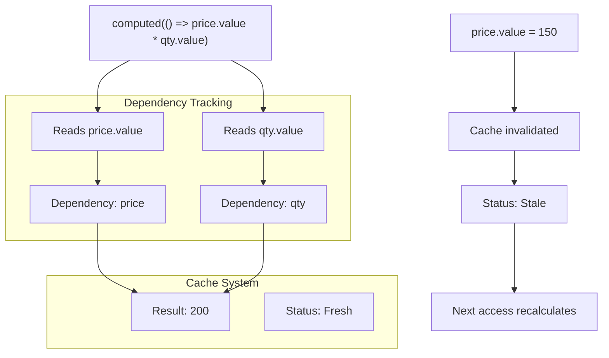
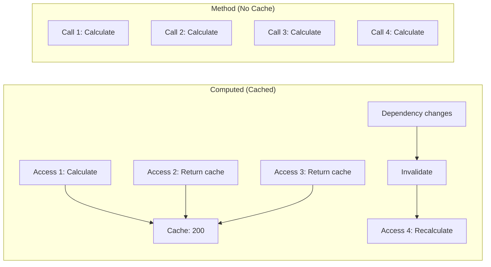
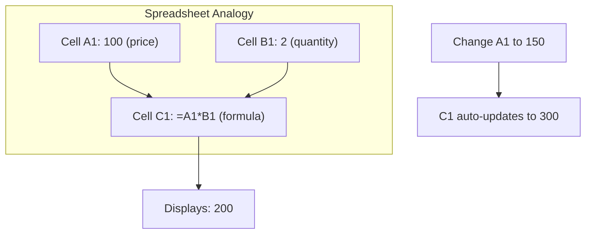
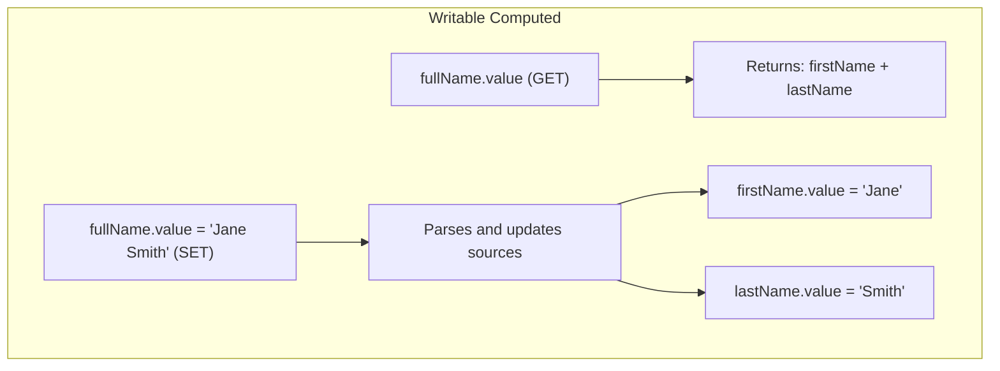
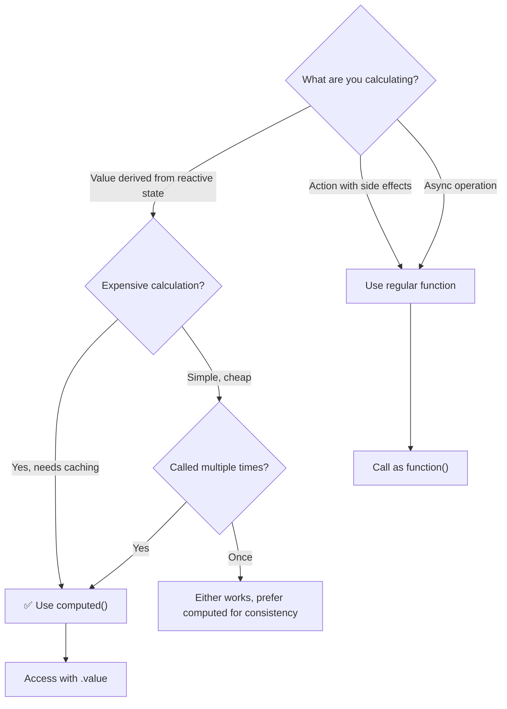
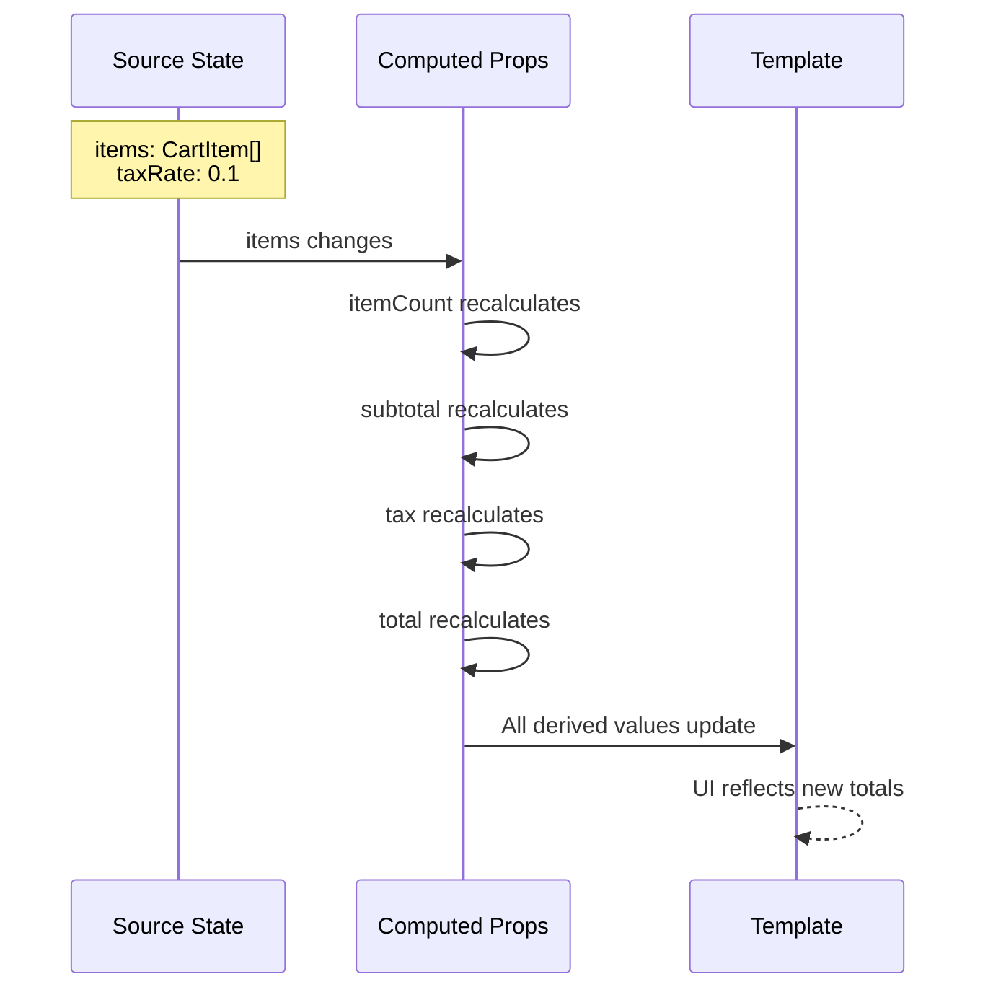
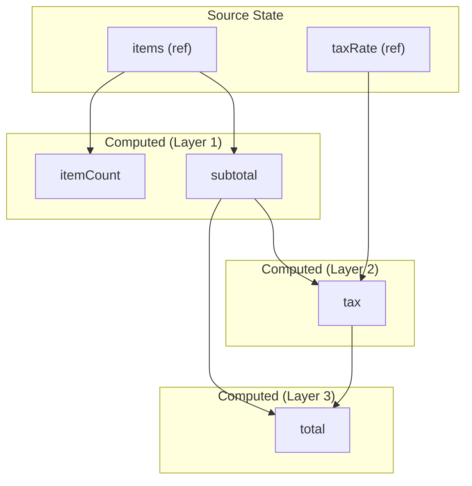
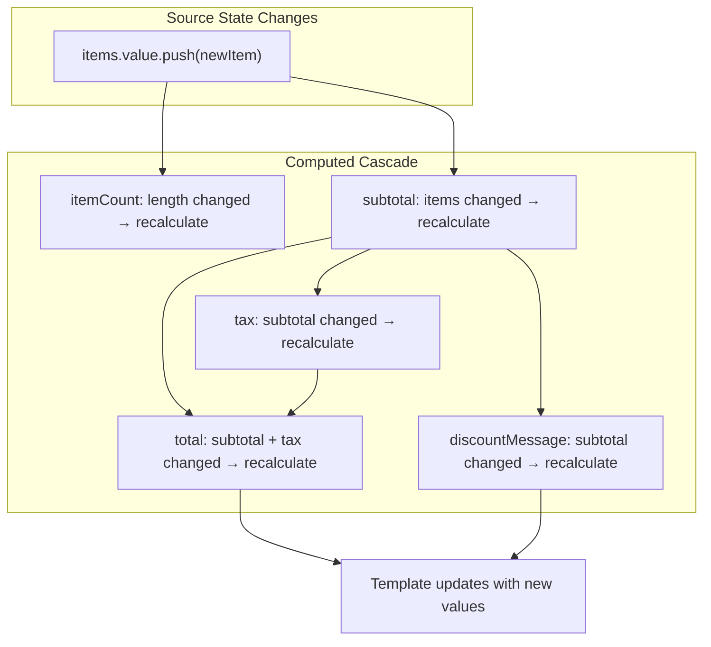

# Lesson 4.1: Derived State with `computed()` — Theory & Concepts (Производное состояние с computed())
---
## 1. Lesson Metadata
| Field               | Value                                                                    |
| :------------------ | :----------------------------------------------------------------------- |
| **Lesson Number**   | 4.1 of 28 (Part 1 of 2)                                                  |
| **Topic**           | Derived State with `computed()` / Производное состояние с computed()     |
| **Module**          | Module 1: Core Fundamentals                                              |
| **Prerequisites**   | Lessons 1, 2, 3 (Components, ref(), reactive())                          |
| **You Should Know** | JavaScript getters/setters, array methods (map, filter, reduce)          |
| **Unlocks**         | Lesson 4.2, then Lesson 5                                                |
| **Duration**        | 30-35 minutes                                                            |
**Learning Objectives — Part 1 (Theory):**
1. **Remember:** Define computed properties and explain when they should be used vs. regular functions
2. **Understand:** Explain how Vue's caching mechanism optimizes computed property performance
---
## 2. JS/TS Toolkit (Refresher)
### Getter Functions
A getter is a function that computes a value when accessed, looking like a property:
```typescript
const user = {
  firstName: "John",
  lastName: "Doe",
  
  // Getter - accessed like a property, computed on demand
  get fullName(): string {
    return `${this.firstName} ${this.lastName}`;
  },
};
console.log(user.fullName); // "John Doe" — no () needed
```
### Array Transformation Methods
Common methods that derive new data from existing arrays:
```typescript
const numbers = [1, 2, 3, 4, 5];
// filter: keep items matching condition
const evens = numbers.filter((n) => n % 2 === 0); // [2, 4]
// map: transform each item
const doubled = numbers.map((n) => n * 2); // [2, 4, 6, 8, 10]
// reduce: combine into single value
const sum = numbers.reduce((acc, n) => acc + n, 0); // 15
// Chaining
const sumOfDoubledEvens = numbers
  .filter((n) => n % 2 === 0)
  .map((n) => n * 2)
  .reduce((acc, n) => acc + n, 0); // 12
```
---
## 3. Real-World Scenario & Context
**Scenario:** You're building a shopping cart. The cart shows a list of items, and you need to display:
- Total number of items
- Subtotal price
- Tax amount (calculated from subtotal)
- Final total
These values are **derived** from the cart items — they depend on the items but shouldn't be stored separately. If you add an item, all totals should update automatically.
**Framework Context:** Vue's `computed()` creates reactive derived values that automatically update when their dependencies change. Unlike regular functions, computed properties are **cached** — they only recalculate when needed, providing better performance.
---
## 4. Core Concepts Explained (Deep Dive)
### What is a Computed Property?
A **computed property** is a value that's calculated from other reactive values. Think of it as a reactive formula:
```typescript
import { ref, computed } from "vue";
const price = ref(100);
const quantity = ref(2);
// Computed: automatically derived from price and quantity
const total = computed(() => price.value * quantity.value);
console.log(total.value); // 200
price.value = 150;
console.log(total.value); // 300 — automatically updated!
```
### How Computed Properties Work
When you create a computed property, Vue:
1. **Tracks dependencies** — notes which reactive values you read
2. **Caches the result** — stores the calculated value
3. **Invalidates cache** — marks as "stale" when dependencies change
4. **Recalculates lazily** — only recomputes when you access it and it's stale

### Caching: Computed vs. Methods
This is the key difference between computed properties and regular functions:
| Aspect           | `computed()`                          | Regular Function                    |
| :--------------- | :------------------------------------ | :---------------------------------- |
| **Recalculation**| Only when dependencies change         | Every time it's called              |
| **Caching**      | ✅ Cached result                      | ❌ No caching                       |
| **Access syntax**| `total.value` (like a ref)            | `getTotal()` (function call)        |
| **Use case**     | Expensive calculations, derived state | Side effects, actions               |

### Mental Model: The Smart Spreadsheet Cell
Think of computed properties like a spreadsheet formula cell:

- Cell C1 contains a **formula**, not a static value
- When A1 or B1 changes, C1 automatically recalculates
- You don't manually update C1 — it's **derived**
- Vue's `computed()` works exactly the same way
### Computed with Getters and Setters
By default, computed properties are read-only. But you can make them writable with a setter:
```typescript
import { ref, computed } from "vue";
const firstName = ref("John");
const lastName = ref("Doe");
// Read-only computed (default)
const fullNameReadOnly = computed(() => {
  return `${firstName.value} ${lastName.value}`;
});
// Writable computed (with getter and setter)
const fullName = computed({
  get: () => `${firstName.value} ${lastName.value}`,
  set: (newValue: string) => {
    const [first, ...rest] = newValue.split(" ");
    firstName.value = first;
    lastName.value = rest.join(" ");
  },
});
fullName.value = "Jane Smith"; // Sets firstName to "Jane", lastName to "Smith"
```

### In Other Contexts
| Framework     | Equivalent Concept                                           |
| :------------ | :----------------------------------------------------------- |
| **React**     | `useMemo()` hook for memoized values                         |
| **Angular**   | Getters in component class, or pipes for templates           |
| **Svelte**    | `$:` reactive declarations                                   |
| **MobX**      | `@computed` decorator                                        |
Vue's `computed()` is most similar to MobX's `@computed` and Svelte's `$:` syntax, but with explicit dependency tracking via the reactivity system.
### When to Use / When NOT to Use

**Use computed() when:**
- Deriving a value from reactive data
- The calculation might be expensive
- The value is used in multiple places
- You want automatic caching
**Use regular functions when:**
- Performing side effects (API calls, console.log)
- The operation is async
- The result shouldn't be cached
- The function takes parameters (that aren't refs)
---
## 5. New Terminology
| Term                    | Definition                                                                                      |
| :---------------------- | :---------------------------------------------------------------------------------------------- |
| **Computed Property**   | A reactive value automatically derived from other reactive values                               |
| **Dependency Tracking** | Vue's automatic detection of which reactive values a computed uses                              |
| **Caching**             | Storing the computed result so it doesn't recalculate unnecessarily                             |
| **Derived State**       | State that's calculated from other state, rather than stored directly                           |
| **Getter/Setter**       | Functions that define how a computed property is read (get) and written (set)                   |
---
## 6. Algorithmic Thinking (Planning the Solution)
When designing derived state, follow this process:
### The Derivation Plan
1. **Identify Source State:** What raw data do you have?
   - Cart items array
   - Tax rate
2. **Define Derived Values:** What do you need to calculate?
   - Item count
   - Subtotal
   - Tax amount
   - Total
3. **Map Dependencies:** Which sources affect which derivations?
   - Item count ← items.length
   - Subtotal ← sum of (item.price × item.quantity)
   - Tax ← subtotal × taxRate
   - Total ← subtotal + tax

### Dependency Graph Example

---
## 7. Initial Pattern Introduction
| What You Want (Intent)           | Code Chunk (The Pattern)                        | Conceptual Link         |
| :------------------------------- | :---------------------------------------------- | :---------------------- |
| Create read-only derived value   | `const x = computed(() => ...)`                 | Cached getter           |
| Create writable derived value    | `computed({ get: () => ..., set: (v) => ... })` | Two-way derivation      |
| Access computed in script        | `computedRef.value`                             | Like a ref              |
| Access computed in template      | `{{ computedRef }}`                             | Auto-unwrapped          |
### The Basic `computed()` Pattern
```vue
<script setup lang="ts">
import { ref, computed } from "vue";
// ============================================
// SOURCE STATE
// ============================================
const items = ref([
  { name: "Apple", price: 1.5, quantity: 3 },
  { name: "Banana", price: 0.75, quantity: 5 },
  { name: "Orange", price: 2.0, quantity: 2 },
]);
const taxRate = ref(0.1); // 10% tax
// ============================================
// COMPUTED PROPERTIES (Derived State)
// ============================================
// Simple computed: count of items
const itemCount = computed((): number => {
  return items.value.length;
});
// Computed with array reduce: calculate subtotal
const subtotal = computed((): number => {
  return items.value.reduce((sum, item) => {
    return sum + item.price * item.quantity;
  }, 0);
});
// Computed depending on another computed
const tax = computed((): number => {
  return subtotal.value * taxRate.value;
});
// Computed depending on multiple computeds
const total = computed((): number => {
  return subtotal.value + tax.value;
});
// Computed with conditional logic
const discountMessage = computed((): string => {
  if (subtotal.value >= 20) {
    return "🎉 You qualify for free shipping!";
  } else {
    const remaining = 20 - subtotal.value;
    return `Add $${remaining.toFixed(2)} more for free shipping`;
  }
});
// ============================================
// ACTIONS (modify source state)
// ============================================
const addItem = (item: { name: string; price: number; quantity: number }) => {
  items.value.push(item);
  // All computed properties automatically update!
};
const removeItem = (index: number) => {
  items.value.splice(index, 1);
  // All computed properties automatically update!
};
</script>
<template>
  <div class="cart">
    <h2>Shopping Cart ({{ itemCount }} items)</h2>
    
    <ul>
      <li v-for="(item, index) in items" :key="item.name">
        {{ item.name }}: ${{ item.price }} × {{ item.quantity }}
        <button @click="removeItem(index)">Remove</button>
      </li>
    </ul>
    
    <div class="totals">
      <p>Subtotal: ${{ subtotal.toFixed(2) }}</p>
      <p>Tax ({{ (taxRate * 100).toFixed(0) }}%): ${{ tax.toFixed(2) }}</p>
      <p class="total">Total: ${{ total.toFixed(2) }}</p>
      <p class="discount">{{ discountMessage }}</p>
    </div>
  </div>
</template>
```
### Writable Computed Example
```vue
<script setup lang="ts">
import { ref, computed } from "vue";
// Source state
const firstName = ref("John");
const lastName = ref("Doe");
// Writable computed with getter and setter
const fullName = computed({
  // Getter: how to read the value
  get: (): string => {
    return `${firstName.value} ${lastName.value}`;
  },
  // Setter: how to write the value (update sources)
  set: (newValue: string): void => {
    const parts = newValue.trim().split(/\s+/);
    firstName.value = parts[0] || "";
    lastName.value = parts.slice(1).join(" ") || "";
  },
});
</script>
<template>
  <div>
    <p>First: {{ firstName }}, Last: {{ lastName }}</p>
    <!-- v-model works with writable computed! -->
    <input v-model="fullName" placeholder="Full name" />
  </div>
</template>
```
### Reactivity Flow Diagram

---
## 8. Comprehension Check
1. **What is the main performance benefit of using `computed()` instead of a regular function for derived values?**
2. **In the shopping cart example, if you change `taxRate.value`, which computed properties will recalculate and why?**
3. **True or False:** A computed property can depend on another computed property, creating a chain of derived values.
---
**Reply 'next' for Lesson 4.2 (Practice).**
