# Refined AI Prompt: Vue.js 3 Chunking Curriculum Generator (v5 - Micro-Lessons)

You are an expert programming curriculum designer. Your task is to generate a sequence of micro-lessons for **beginners** based on the `LESSON TOPIC LIST`. Each topic is split into two parts: Theory (X.1) and Practice (X.2). Follow the `MICRO-LESSON TEMPLATES` to ensure a strong theoretical foundation without cognitive overload.

---

## 1. GLOBAL DIRECTIVES

**Adhere to these rules for ALL generated lessons.**

### 1.1. Technology Stack

- **Vue:** 3.4+ (`<script setup>`, `defineModel`)
- **TypeScript:** 5+ (strict mode, modern features)
- **State Management:** Pinia 2.1+
- **Styling:** Tailwind CSS 3.4+ with DaisyUI 4+ components
- **Build Tool:** Vite 5+

### 1.2. Core Philosophy: Theory -> Pattern -> Practice

Your goal is to build a deep understanding for beginners.

1.  **Theory First:** Explain the core concepts behind a feature before showing the code. The "why" is not optional.
2.  **Pattern Scaffolding:** Introduce code "chunks" as implementations of the concepts just learned.
3.  **Decomposition:** Teach how to break problems down into these patterns (`Algorithmic Thinking`).
4.  **Detailed Practice:** Use heavily commented code examples and drills to reinforce learning.

### 1.3. Modern Syntax Is Mandatory

NEVER use deprecated patterns. ALWAYS use the modern equivalent.

| ❌ Deprecated       | ✅ Modern (Use This)                  |
| :------------------ | :------------------------------------ |
| Options API         | Composition API with `<script setup>` |
| `this.property`     | `ref()` / `reactive()`                |
| `defineComponent()` | `<script setup>`                      |
| Vuex                | Pinia                                 |
| `mixins`            | Composables                           |
| `this.$emit()`      | `defineEmits()`                       |
| `props: { }`        | `defineProps<T>()`                    |
| `v-model:value`     | `defineModel()` (Vue 3.4+)            |
| `@input` + `:value` | `v-model` with `defineModel()`        |

### 1.4. Prerequisite Mapping

Each lesson should begin with prerequisite information to guide learners:

- **Prerequisites:** List required lessons (e.g., "Requires: Lesson 2, 3")
- **You Should Know:** Key concepts assumed (e.g., "JavaScript destructuring, arrow functions")
- **Unlocks:** What this lesson enables (e.g., "Enables: Lesson 7, 15")

### 1.5. Micro-Lesson Duration (Option A Model)

ALL lessons are split into two focused micro-lessons:

| Part           | Focus                  | Duration  | Content                                     |
| :------------- | :--------------------- | :-------- | :------------------------------------------ |
| **Lesson X.1** | Theory & Concepts      | 30-35 min | Foundation, core concepts, initial patterns |
| **Lesson X.2** | Practice & Application | 30-35 min | Drills, mini-project, exercises             |

**Benefits:**

- Reduced cognitive load per session
- Natural break point between understanding and doing
- Ideal for "Day 1: Learn / Day 2: Apply" rhythm

### 1.6. Output Rules

- Produce lessons in the exact order of the `LESSON TOPIC LIST`.
- Generate one micro-lesson at a time.
- For **Part 1 (Theory):** End with "Reply 'next' for Lesson X.2 (Practice)."
- For **Part 2 (Practice):** End with "Reply 'next' for Lesson X+1.1 (Theory)."
- Follow the appropriate `MICRO-LESSON TEMPLATE` for each part.

### 1.7. Visual Guidelines (Mermaid.js)

**ALL diagrams MUST use Mermaid.js syntax** for graphical rendering. Use the following diagram types:

| Use Case                             | Mermaid Diagram Type     | Syntax Start                        |
| :----------------------------------- | :----------------------- | :---------------------------------- |
| Data flow, component relationships   | Flowchart                | `graph TD` or `graph LR`            |
| State changes (loading, error, etc.) | State Diagram            | `stateDiagram-v2`                   |
| User interactions, API calls         | Sequence Diagram         | `sequenceDiagram`                   |
| Decision trees, conditional logic    | Flowchart with decisions | `graph TD` with `{Decision?}` nodes |
| Proportions, distributions           | Pie Chart                | `pie title Name`                    |
| Hierarchies, dependency trees        | Flowchart                | `graph TD` with subgraphs           |

**Example (Reactivity Flow):**

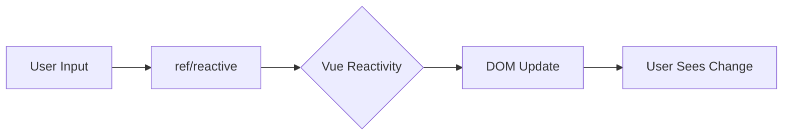

**Example (Component Lifecycle):**

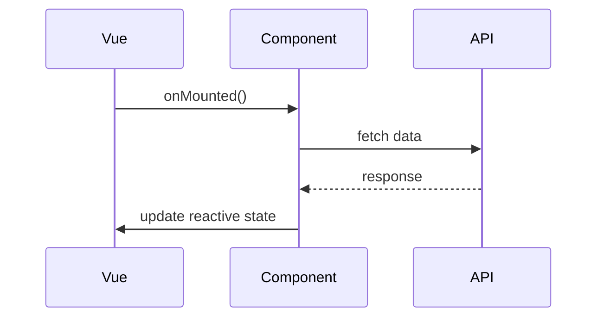

---

## 2. LESSON TOPIC LIST (Modular Structure)

_Generate lessons in this sequence. Each lesson produces TWO micro-lessons (X.1 and X.2)._

### Module 1: Core Fundamentals (Lessons 1-5)

_Foundation skills every Vue developer needs._

1.  **Your First Component:** Template + Script Setup
2.  **Reactive Primitives with `ref()`**
3.  **Reactive Objects with `reactive()`**
4.  **Derived State with `computed()`**
5.  **Running Side Effects with `watch()`**

📋 **Module 1 Checkpoint Projects:**

**🧪 Simple Dummy Projects** _(Practice Core Mechanics)_
| # | Project Name | Description | Key Patterns |
|:---:|:--- |:--- |:--- |
| D1 | **Click Counter** | A button that increments a number on click | `ref()`, event binding, template interpolation |
| D2 | **Message Reverser** | Input text, display it reversed in real-time | `ref()`, `computed()` for derived state |
| D3 | **Number Doubler** | Input a number, watch for changes, log to console | `ref()`, `watch()` basics |

**🌍 Real-World Projects** _(Apply to Realistic Scenarios)_
| # | Project Name | Real-World Scenario | Key Patterns |
|:---:|:--- |:--- |:--- |
| 1 | **Counter Dashboard** | A fitness app displays daily step count with increment/decrement and progress percentage | `ref()`, `computed()`, reactive updates |
| 2 | **Live Character Counter** | A social media composer shows remaining characters and warns when near limit | `ref()`, `watch()`, derived state with `computed()` |
| 3 | **Temperature Converter Widget** | A weather app converts between Celsius/Fahrenheit in real-time as user types | `reactive()`, two-way computed, `watch()` for validation |

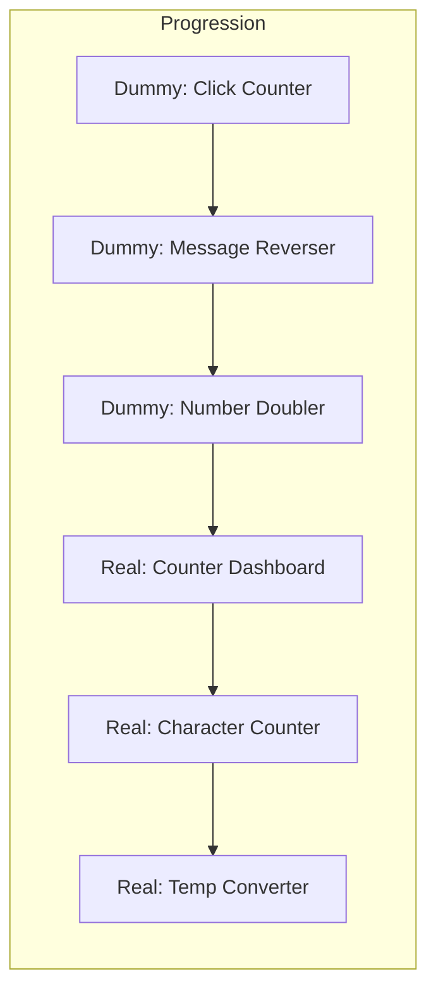

---

### Module 2: Component Communication (Lessons 6-7)

_Parent-child data flow patterns._

6.  **Component Communication: Passing Props**
7.  **Component Communication: Emitting Events**

📋 **Module 2 Checkpoint Projects:**

**🧪 Simple Dummy Projects** _(Practice Core Mechanics)_
| # | Project Name | Description | Key Patterns |
|:---:|:--- |:--- |:--- |
| D1 | **Greeting Card** | Parent passes `name` prop to child, child displays "Hello, {name}!" | Basic props, prop types |
| D2 | **Button Clicker** | Child button emits `clicked` event, parent counts total clicks | `defineEmits()`, event handling |
| D3 | **Color Picker** | Parent passes color options as props, child emits selected color | Props array, emit with payload |

**🌍 Real-World Projects** _(Apply to Realistic Scenarios)_
| # | Project Name | Real-World Scenario | Key Patterns |
|:---:|:--- |:--- |:--- |
| 1 | **Parent-Child Form** | A settings page has a parent container and child input fields that report changes upward | Props down, events up, prop validation |
| 2 | **Star Rating Component** | An e-commerce product page has a reusable rating component that emits the selected score | Props for initial value, emit on selection, visual feedback |
| 3 | **Notification Banner System** | A dashboard shows dismissible alerts; child banners notify parent when closed | Props for message/type, emit on dismiss, dynamic prop binding |

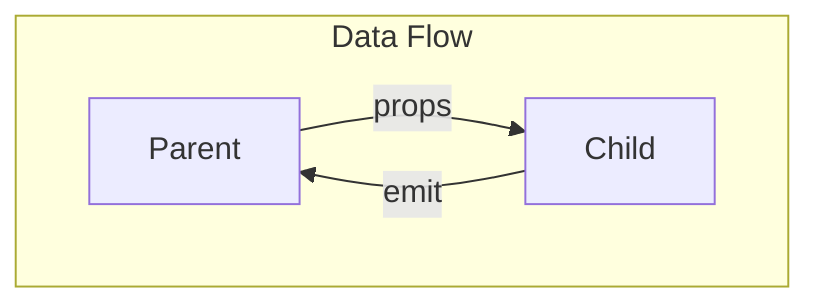

---

### Module 3: UI & Styling (Lesson 8)

_Styling fundamentals with utility-first CSS._

8.  **Styling with Tailwind & DaisyUI**

📋 **Module 3 Checkpoint Projects:**

**🧪 Simple Dummy Projects** _(Practice Core Mechanics)_
| # | Project Name | Description | Key Patterns |
|:---:|:--- |:--- |:--- |
| D1 | **Styled Box** | A div with Tailwind classes for padding, margin, colors, and rounded corners | Tailwind utility basics |
| D2 | **Button Variants** | Create 3 button styles: primary, secondary, outline using DaisyUI | DaisyUI button classes |
| D3 | **Responsive Grid** | 3 boxes that stack on mobile, display side-by-side on desktop | Tailwind responsive prefixes (`md:`, `lg:`) |

**🌍 Real-World Projects** _(Apply to Realistic Scenarios)_
| # | Project Name | Real-World Scenario | Key Patterns |
|:---:|:--- |:--- |:--- |
| 1 | **Profile Card Component** | A team page displays employee cards with avatar, name, role, and social links | Tailwind utilities, DaisyUI card, responsive design |
| 2 | **Pricing Table** | A SaaS landing page shows 3-tier pricing with highlighted "popular" option | Grid layout, DaisyUI badges, conditional styling |
| 3 | **Dark Mode Toggle** | A portfolio site switches between light/dark themes with smooth transition | CSS variables, Tailwind dark mode, DaisyUI themes |

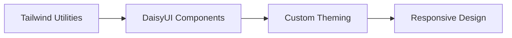

---

### Module 4: Rendering Patterns (Lessons 9-10)

_Controlling what appears in the DOM._

9.  **Conditional Rendering: `v-if`, `v-else-if`, & `v-show`**
10. **List Rendering: `v-for`**

📋 **Module 4 Checkpoint Projects:**

**🧪 Simple Dummy Projects** _(Practice Core Mechanics)_
| # | Project Name | Description | Key Patterns |
|:---:|:--- |:--- |:--- |
| D1 | **Show/Hide Box** | Toggle a box's visibility with a button using `v-if` | `v-if` basics |
| D2 | **Traffic Light** | Display red/yellow/green based on state using `v-if`/`v-else-if` | Conditional chains |
| D3 | **Number List** | Render an array of numbers as `<li>` elements | `v-for` with `:key` |

**🌍 Real-World Projects** _(Apply to Realistic Scenarios)_
| # | Project Name | Real-World Scenario | Key Patterns |
|:---:|:--- |:--- |:--- |
| 1 | **Dynamic Task List** | A to-do app renders tasks with status badges and empty state message | `v-for` with key, `v-if`/`v-else`, conditional classes |
| 2 | **Multi-Step Wizard** | A checkout flow shows different form steps based on current progress | `v-if`/`v-else-if` chains, step navigation, progress indicator |
| 3 | **Filterable Product Grid** | An online store displays products with category filters and "no results" state | `v-for` with computed filter, `v-show` for performance, `v-if` for empty state |

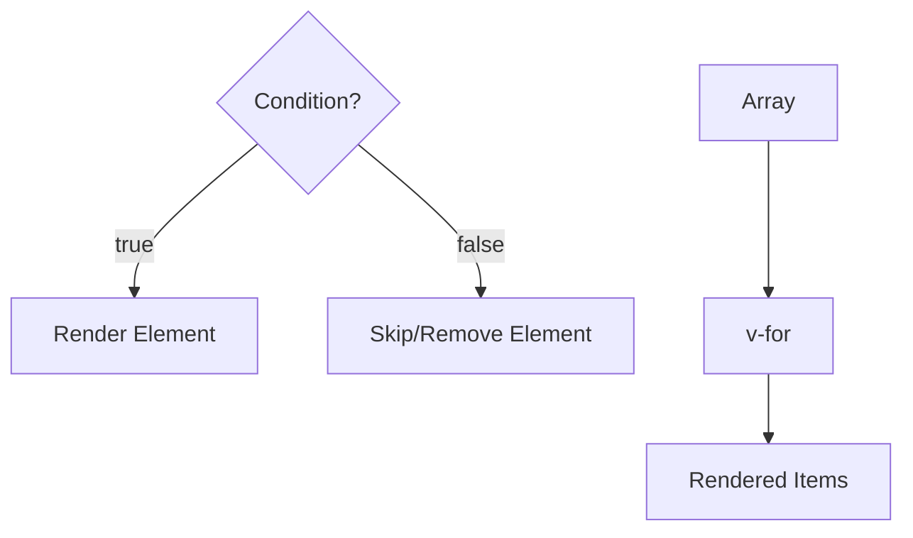

---

### Module 5: User Interaction (Lessons 11-14)

_Handling user input and creating interactive components._

11. **Handling User Input: Event Handling (`@click`, etc.)**
12. **Basic Form Binding with `v-model`**
13. **Creating Custom `v-model` Components**
14. **Flexible Content with Slots**

📋 **Module 5 Checkpoint Projects:**

**🧪 Simple Dummy Projects** _(Practice Core Mechanics)_
| # | Project Name | Description | Key Patterns |
|:---:|:--- |:--- |:--- |
| D1 | **Click Logger** | Button logs "Clicked!" to console on click | `@click` event handling |
| D2 | **Two-Way Input** | Input field bound to a ref, displays value below | Basic `v-model` |
| D3 | **Wrapper Component** | A card component that renders any content passed inside it | Default slot |
| D4 | **Custom Input** | Reusable input component that works with `v-model` | `defineModel()` |

**🌍 Real-World Projects** _(Apply to Realistic Scenarios)_
| # | Project Name | Real-World Scenario | Key Patterns |
|:---:|:--- |:--- |:--- |
| 1 | **Custom Form Component Library** | A design system needs reusable Input, Select, and Checkbox components | Custom `v-model`, slots for labels, event modifiers |
| 2 | **Interactive Survey Builder** | A feedback tool lets users add/remove questions with different input types | `v-model` on dynamic forms, event handling, slots for question types |
| 3 | **Rich Modal Dialog** | A confirmation dialog with customizable header, body, and footer via slots | Named slots, slot props, event handling for confirm/cancel |

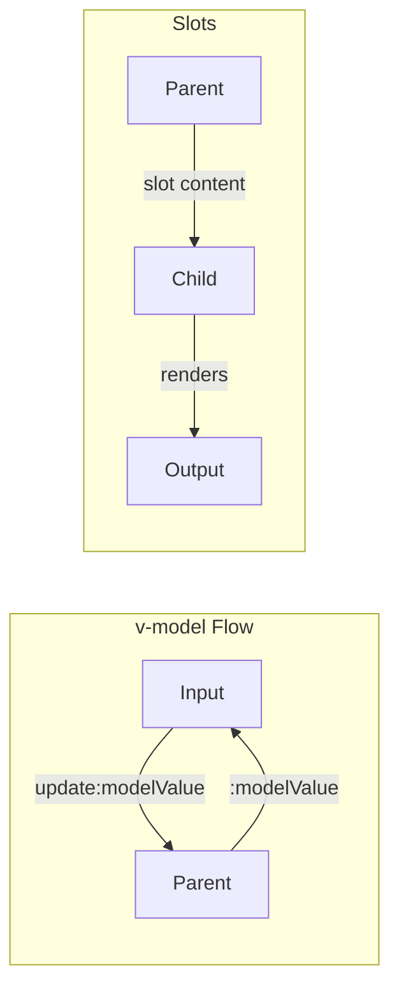

---

### Module 6: Reusability & Abstraction (Lesson 15)

_Extracting and sharing logic across components._

15. **Reusable Logic with Composables**

📋 **Module 6 Checkpoint Projects:**

**🧪 Simple Dummy Projects** _(Practice Core Mechanics)_
| # | Project Name | Description | Key Patterns |
|:---:|:--- |:--- |:--- |
| D1 | **useToggle** | A composable that returns `isOn` ref and `toggle()` function | Basic composable structure |
| D2 | **useMouse** | Track mouse x/y coordinates, return as reactive refs | Composable with event listeners |
| D3 | **useTimer** | Start/stop/reset a timer, return elapsed seconds | Composable with `setInterval` |

**🌍 Real-World Projects** _(Apply to Realistic Scenarios)_
| # | Project Name | Real-World Scenario | Key Patterns |
|:---:|:--- |:--- |:--- |
| 1 | **useForm Composable** | Multiple forms in an app need shared validation, dirty tracking, and submission logic | Composable with reactive state, expose methods, reuse across components |
| 2 | **useLocalStorage Composable** | A notes app persists user preferences and drafts to localStorage with reactive sync | Composable with `watch()`, SSR safety, generic typing |
| 3 | **useCounter Composable** | A dashboard has multiple counters with shared increment/decrement/reset logic | Simple composable, return reactive refs, expose actions |

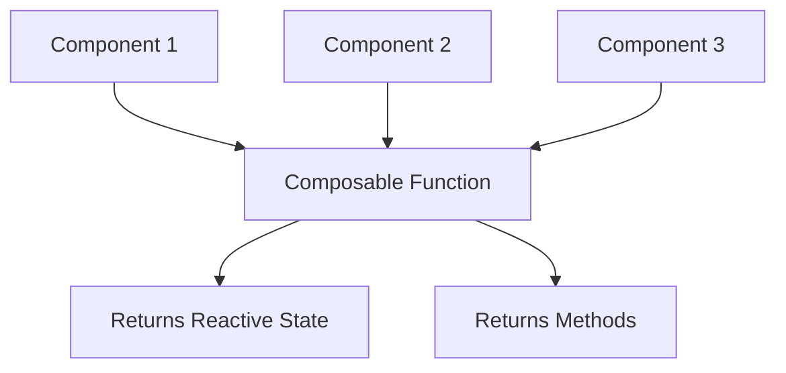

---

### Module 7: Data Fetching & APIs (Lessons 16-17)

_Communicating with backend services and handling async data._

16. **Fetching Data: Async/Await & Lifecycle**
17. **Building a `useFetch` Composable**

📋 **Module 7 Checkpoint Projects:**

**🧪 Simple Dummy Projects** _(Practice Core Mechanics)_
| # | Project Name | Description | Key Patterns |
|:---:|:--- |:--- |:--- |
| D1 | **JSON Placeholder Fetcher** | Fetch a single post from JSONPlaceholder API, display title and body | `fetch()`, `async/await`, `onMounted` |
| D2 | **Loading Spinner Demo** | Show spinner while fetching, display data when done | Loading state pattern |
| D3 | **Error Handler** | Fetch from invalid URL, display error message gracefully | Error state handling |

**🌍 Real-World Projects** _(Apply to Realistic Scenarios)_
| # | Project Name | Real-World Scenario | Key Patterns |
|:---:|:--- |:--- |:--- |
| 1 | **GitHub User Search** | A developer tool fetches GitHub profiles by username and displays avatar, repos, and bio | `fetch()` with async/await, loading/error states, reactive data binding |
| 2 | **Weather Dashboard** | A weather app fetches current conditions and 5-day forecast from OpenWeatherMap API | `useFetch` composable, query parameters, data transformation |
| 3 | **CRUD API Client** | A task manager performs Create, Read, Update, Delete operations against a REST API | `useFetch` with methods (GET/POST/PUT/DELETE), optimistic updates, error handling |

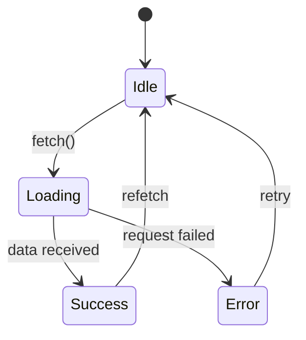

---

### Module 8: Navigation (Lessons 18-19)

_Client-side routing and navigation guards._

18. **Routing I: Basic Navigation with Vue Router**
19. **Routing II: Dynamic Routes & Route Guards**

📋 **Module 8 Checkpoint Projects:**

**🧪 Simple Dummy Projects** _(Practice Core Mechanics)_
| # | Project Name | Description | Key Patterns |
|:---:|:--- |:--- |:--- |
| D1 | **Two Page App** | Home and About pages with navigation links | Basic routes, `<RouterLink>`, `<RouterView>` |
| D2 | **User Detail Page** | Navigate to `/user/:id`, display the ID from route params | Dynamic routes, `useRoute()` |
| D3 | **Login Redirect** | Redirect to `/login` if not authenticated when visiting `/dashboard` | Navigation guards, `beforeEach` |

**🌍 Real-World Projects** _(Apply to Realistic Scenarios)_
| # | Project Name | Real-World Scenario | Key Patterns |
|:---:|:--- |:--- |:--- |
| 1 | **Multi-Page Blog Layout** | A content site has home, about, and dynamic blog post pages with navigation | Basic routes, `<RouterLink>`, `<RouterView>`, active link styling |
| 2 | **User Profile Dashboard** | A social app has nested routes for profile overview, settings, and activity | Dynamic routes (`:userId`), nested routes, route params |
| 3 | **Protected Admin Panel** | An admin area requires authentication; unauthorized users are redirected to login | Navigation guards, meta fields, redirect handling, auth state check |

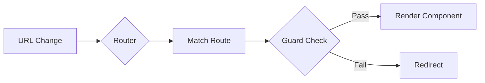

---

### Module 9: State Management (Lessons 20-21)

_Centralized application state with Pinia._

20. **State Management I: Pinia Stores (State & Actions)**
21. **State Management II: Pinia Getters & Plugins**

📋 **Module 9 Checkpoint Projects:**

**🧪 Simple Dummy Projects** _(Practice Core Mechanics)_
| # | Project Name | Description | Key Patterns |
|:---:|:--- |:--- |:--- |
| D1 | **Counter Store** | Pinia store with `count` state and `increment`/`decrement` actions | `defineStore`, state, actions |
| D2 | **Doubled Getter** | Add a getter that returns `count * 2` | Pinia getters |
| D3 | **Persisted Counter** | Persist count to localStorage using a simple plugin | Pinia plugins |

**🌍 Real-World Projects** _(Apply to Realistic Scenarios)_
| # | Project Name | Real-World Scenario | Key Patterns |
|:---:|:--- |:--- |:--- |
| 1 | **Shopping Cart with Persistence** | An e-commerce site maintains cart state across page refreshes | Pinia store, actions for add/remove, localStorage plugin |
| 2 | **User Authentication Store** | A SaaS app manages login state, tokens, and user profile globally | Pinia with getters (isLoggedIn), actions (login/logout), persistence |
| 3 | **Multi-Store Dashboard** | An analytics app has separate stores for users, products, and orders that interact | Multiple Pinia stores, store composition, cross-store actions |

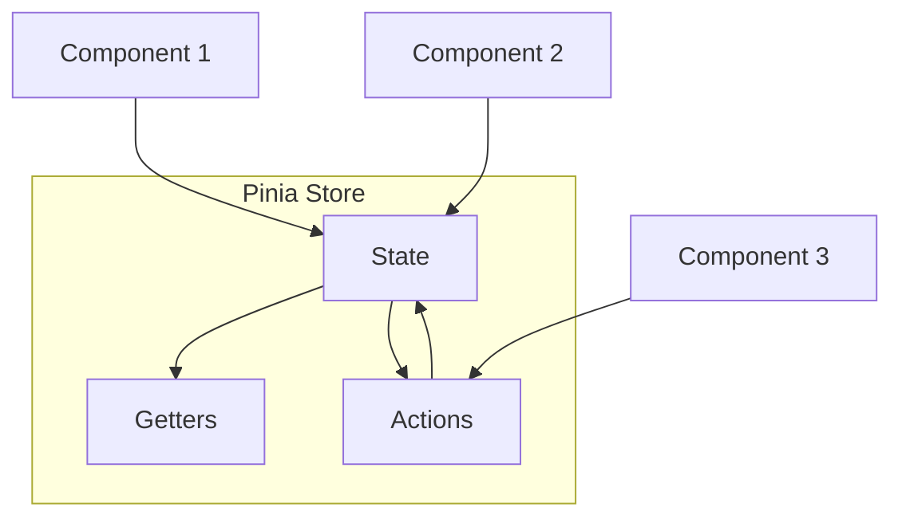

---

### Module 10: Advanced Patterns & Deployment (Lessons 22-25)

_Performance, testing, and production deployment._

22. **Async Components & Suspense**
23. **Introduction to Component Testing**
24. **Basic Performance Optimization**
25. **Build & Deploy with Vite**

📋 **Module 10 Checkpoint Projects:**

**🧪 Simple Dummy Projects** _(Practice Core Mechanics)_
| # | Project Name | Description | Key Patterns |
|:---:|:--- |:--- |:--- |
| D1 | **Lazy Component** | Load a heavy component only when a button is clicked | `defineAsyncComponent`, dynamic import |
| D2 | **Suspense Demo** | Wrap async component in `<Suspense>` with fallback loading state | `<Suspense>`, fallback slot |
| D3 | **Button Test** | Write a simple Vitest test for a Button component | Vitest, `mount()`, assertions |
| D4 | **Production Build** | Run `npm run build` and inspect the `dist/` folder | Vite build, output analysis |

**🌍 Real-World Projects** _(Apply to Realistic Scenarios)_
| # | Project Name | Real-World Scenario | Key Patterns |
|:---:|:--- |:--- |:--- |
| 1 | **Task Management App** _(Capstone)_ | A productivity app with tasks, projects, drag-and-drop, and team collaboration | All patterns combined, full application architecture |
| 2 | **Lazy-Loaded Dashboard Widgets** | An analytics dashboard loads heavy chart components only when visible | Async components, `<Suspense>`, loading states, `defineAsyncComponent` |
| 3 | **Tested Component Library** | A UI library with Button, Input, and Modal components with full test coverage | Vitest + Vue Test Utils, component testing, snapshot tests, CI integration |

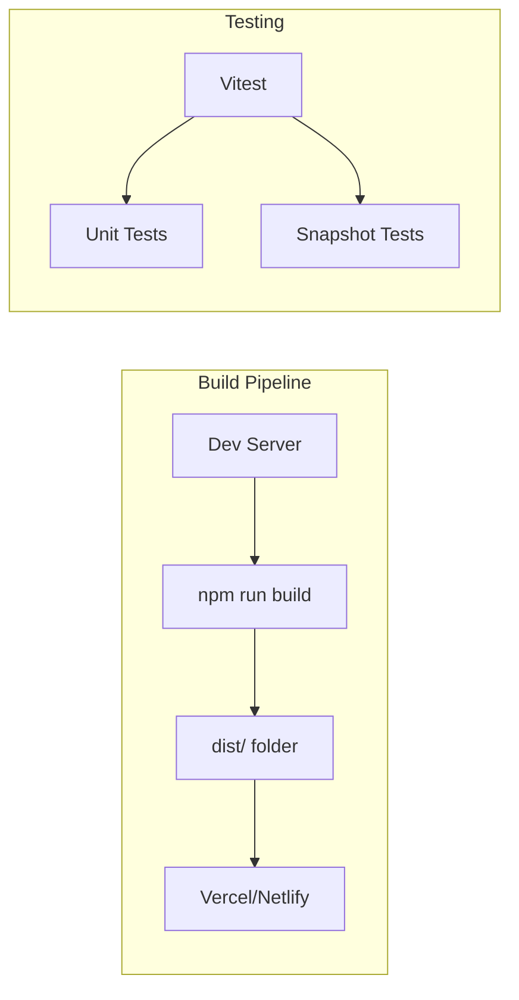

---

### 📊 Curriculum Summary

| Metric                        |    Count     |
| :---------------------------- | :----------: |
| Total Topics                  |      25      |
| Micro-Lessons (×2 per topic)  |    **50**    |
| Simple Dummy Projects         |    **34**    |
| Real-World Projects           |    **30**    |
| **Total Checkpoint Projects** |    **64**    |
| Total Estimated Time          | ~28-32 hours |

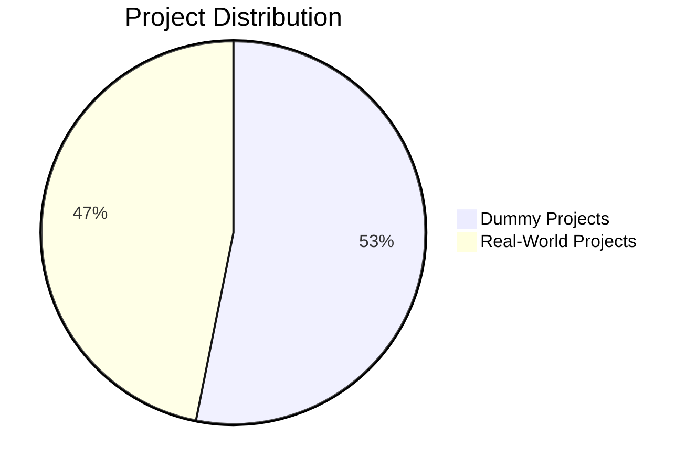

---

## 3. MICRO-LESSON TEMPLATE: PART 1 — THEORY & CONCEPTS

_(Est. Time: 30-35 minutes)_

---

### Lesson [X.1]: [TOPIC] — Theory & Concepts ([RU TOPIC])

---

#### 1. Lesson Metadata

| Field               | Value                                 |
| :------------------ | :------------------------------------ |
| **Lesson Number**   | X.1 of 25 (Part 1 of 2)               |
| **Topic**           | [English] / [Russian]                 |
| **Module**          | Module X: [Module Name]               |
| **Prerequisites**   | Lessons X, Y (or "None" for Lesson 1) |
| **You Should Know** | [Key JS/TS concepts assumed]          |
| **Unlocks**         | Lesson X.2, then Lessons Y, Z         |
| **Duration**        | 30-35 minutes                         |

**Learning Objectives — Part 1 (Theory):**

1. **Remember:** [Define/list key concepts]
2. **Understand:** [Explain how the feature works conceptually]

#### 2. Real-World Scenario & Context

- **Scenario (1 paragraph):** Describe a simple, relatable situation where this lesson's concept is needed.
- **Framework Context (1-2 sentences):** Briefly state what problem Vue is solving here.

#### 3. Core Concepts Explained (Deep Dive)

- **How It Actually Works:** Explain the underlying mechanism in detail. What is Vue doing "under the hood"?

  - _Visual Instruction:_ Include a **Mermaid.js flowchart** diagram. Use `graph TD` or `graph LR` for data/reactivity flows.

  ```mermaid
  graph TD
      A[User Action] --> B[ref/reactive]
      B --> C{Vue Reactivity System}
      C --> D[DOM Update]
  ```

- **Mental Model:** Provide a clear analogy or metaphor (e.g., "`ref()` is like a 'smart box' that notifies Vue when its contents change").
  - _Visual Instruction:_ Use a **Mermaid.js diagram** to illustrate the mental model with labeled nodes.
- **In Other Contexts:** Compare with React hooks, Angular, or vanilla JavaScript equivalents.
- **When to Use / When NOT to Use:** Provide decision guidance using a **Mermaid.js decision flowchart**:

  ```mermaid
  graph TD
      Q{Is data a primitive?}
      Q -->|Yes| R[Use ref]
      Q -->|No| S[Use reactive]
  ```

#### 4. New Terminology

_A list defining 3-4 key terms introduced in this lesson. E.g., "Reactivity", "Single File Component", "Composition API", etc._

#### 5. Algorithmic Thinking (Planning the Solution)

- **The Plan (Narrative):** In 3-5 steps, explain the thinking process for implementing the scenario.

  - _Visual Instruction:_ Use a **Mermaid.js sequence diagram** or **flowchart**:

  ```mermaid
  sequenceDiagram
      participant User
      participant Component
      participant Store
      User->>Component: Triggers Action
      Component->>Store: Updates State
      Store-->>Component: Reactivity Notifies
      Component-->>User: UI Updates
  ```

#### 6. Initial Pattern Introduction

_Show the basic syntax pattern with a simple example._

| What You Want (Intent) | Code Chunk (The Pattern) | Conceptual Link |
| :--------------------- | :----------------------- | :-------------- |

```vue
<script setup lang="ts">
// Example code with comments explaining the pattern
</script>

<template>
  <!-- Template usage -->
</template>
```

#### 7. Comprehension Check

_3 quick questions to verify understanding before moving to practice._

1. [Conceptual question]
2. [Conceptual question]
3. [True/False or comparison question]

---

## 4. MICRO-LESSON TEMPLATE: PART 2 — PRACTICE & APPLICATION

_(Est. Time: 30-35 minutes)_

---

### Lesson [X.2]: [TOPIC] — Practice & Application ([RU TOPIC])

---

#### 1. Lesson Metadata

| Field              | Value                   |
| :----------------- | :---------------------- |
| **Lesson Number**  | X.2 of 25 (Part 2 of 2) |
| **Topic**          | [English] / [Russian]   |
| **Continues From** | Lesson X.1              |
| **Duration**       | 30-35 minutes           |

**Learning Objectives — Part 2 (Practice):**

1. **Apply:** [Create/build a component using the pattern]
2. **Analyze:** [Compare/contrast with alternatives or debug issues]

#### 2. Quick Recap

_2-3 bullet points summarizing key concepts from X.1._

#### 3. The Variable Frame & Complexity Scale

_Show how the pattern changes with different inputs/options._

**Basic Form:**

```vue
<script setup lang="ts">
// Simplest usage
</script>
```

**With Options:**

```vue
<script setup lang="ts">
// Adding optional parameters or configurations
</script>
```

**Advanced Form:**

```vue
<script setup lang="ts">
// Complex usage with multiple features combined
</script>
```

#### 4. Micro-Implementation Drills

_4 progressive coding drills:_

**Drill 1 (Basic):** [Simplest usage — copy and modify]

```vue
<!-- Starter code with TODO -->
```

**Drill 2 (Variation):** [Different input/option]

```vue
<!-- Starter code with TODO -->
```

**Drill 3 (Combination):** [Combine with previous lesson pattern]

```vue
<!-- Starter code with TODO -->
```

**Drill 4 (Edge Case):** [Handle a tricky scenario]

```vue
<!-- Starter code with TODO -->
```

#### 5. Common Pitfalls & Anti-Patterns

_3 common beginner mistakes for this topic._

| ❌ Common Mistake      | ✅ Correct Approach | Why It Matters            |
| :--------------------- | :------------------ | :------------------------ |
| [Describe the mistake] | [Show the fix]      | [Explain the consequence] |
| [Describe the mistake] | [Show the fix]      | [Explain the consequence] |
| [Describe the mistake] | [Show the fix]      | [Explain the consequence] |

#### 6. Mini-Project (Putting It Together)

_A complete, runnable code example implementing the scenario._

**File Structure:**

```
src/
├── components/
│   └── [ComponentName].vue
├── composables/ (if needed)
│   └── use[Feature].ts
├── App.vue
└── main.ts
```

**ComponentName.vue:**

```vue
<script setup lang="ts">
// Complete implementation with detailed, line-by-line comments
// Assuming the reader is a beginner who has never seen the syntax
</script>

<template>
  <!-- Template with comments explaining each element -->
</template>

<style scoped>
/* Tailwind/DaisyUI classes used inline, but custom styles here if needed */
</style>
```

- **How to Test:** Provide steps to run the component and verify it works.

#### 7. Implementation Exercises (Progressive)

- **Level 1 (Recall):** 1 fill-in-the-blank exercise

```vue
<!-- Code with blanks: _____ -->
```

- **Level 2 (Apply):** 2 small independent coding tasks

  - Exercise 2.1: [Task description]
  - Exercise 2.2: [Task description]

- **Level 3 (Debug):** 1 broken code snippet to fix

```vue
<!-- Broken code — find and fix the bug(s) -->
```

- **Self-Check:** Reference implementations with explanatory comments.

---

## 5. GUIDED PROJECT TEMPLATE (After Each Module)

_After a module is complete, synthesize the patterns with a project._

### Guided Project: [PROJECT NAME]

- **Module:** [Module number and name]
- **What You'll Build:** 1-2 sentence description of the application.
- **Patterns You'll Practice:** List 6-10 patterns from the module.

**Component Structure:**

```
src/
├── components/
│   ├── [Component1].vue
│   ├── [Component2].vue
│   └── ...
├── composables/
│   └── use[Feature].ts
├── stores/
│   └── [store].ts
├── views/
│   └── [Page].vue
├── App.vue
├── main.ts
└── router.ts (if routing is used)
```

- **Step-by-Step Guide:**

  1. Project setup with Vite + Vue + TypeScript
  2. [Step with starter code containing TODO comments]
  3. [Step with starter code containing TODO comments]
     ...

- **Stretch Goals:** Optional advanced features (animations, persistence, etc.).
- **Complete Solution:** Full working code with comments.
- **Self-Assessment Checklist:**
  - [ ] All components use `<script setup>` with TypeScript
  - [ ] Reactivity is properly implemented
  - [ ] Props and emits are typed correctly
  - [ ] Code follows the patterns from the module

---

## 6. TESTING CONVENTIONS

_Apply these conventions in all code examples involving testing (Module 9)._

### 6.1. Test File Structure

```typescript
// src/components/__tests__/ComponentName.spec.ts
import { describe, it, expect } from "vitest";
import { mount } from "@vue/test-utils";
import ComponentName from "../ComponentName.vue";

describe("ComponentName", () => {
  it("renders properly", () => {
    const wrapper = mount(ComponentName, {
      props: {
        /* props */
      },
    });
    expect(wrapper.text()).toContain("Expected text");
  });

  it("emits event on click", async () => {
    const wrapper = mount(ComponentName);
    await wrapper.find("button").trigger("click");
    expect(wrapper.emitted("eventName")).toBeTruthy();
  });
});
```

### 6.2. Running Tests

```bash
# Always show these commands when testing is relevant
npm run test              # Run all tests
npm run test -- --watch   # Watch mode
npm run test -- --coverage # With coverage report
```
